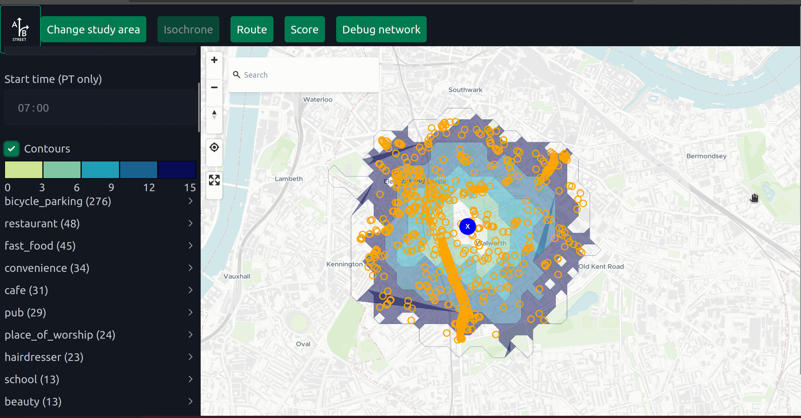
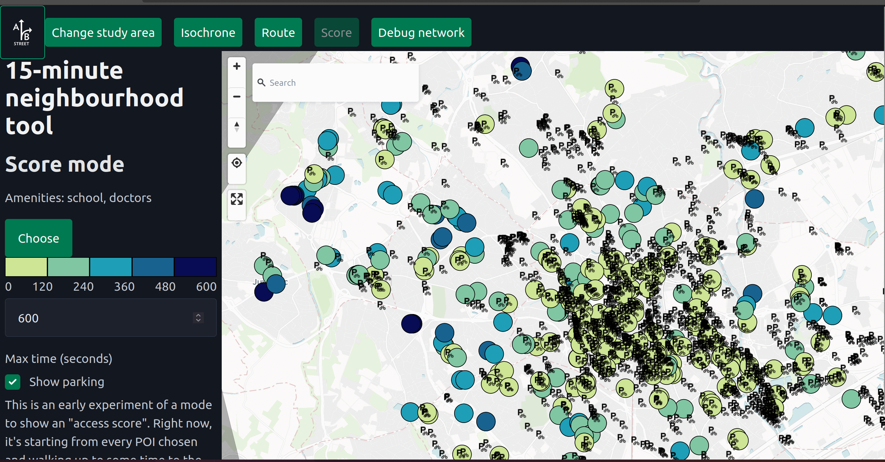
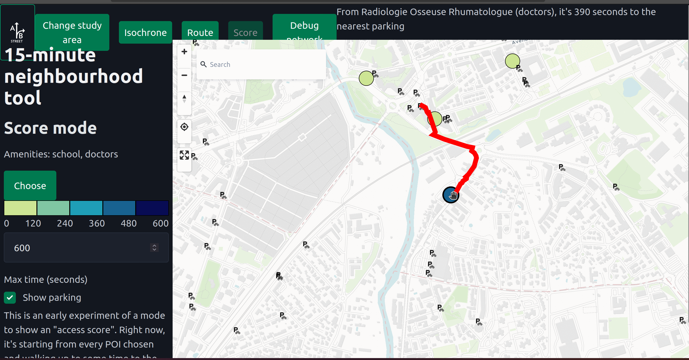
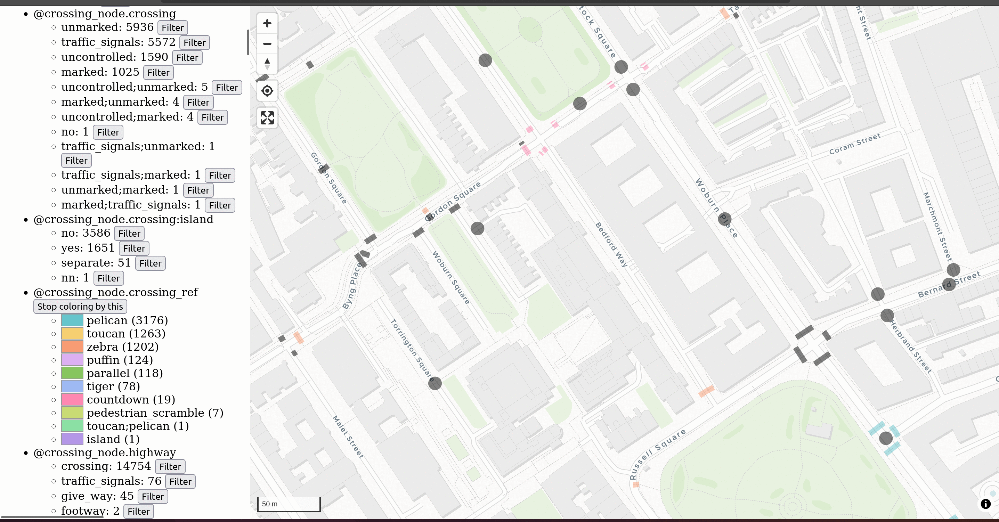
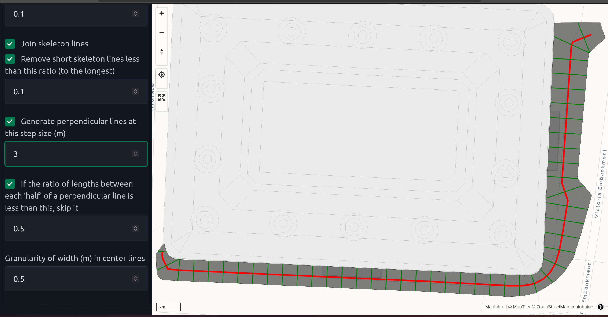

June 21, 2024

Ahead of my next big(ish) trip and amid some other pressures to write, it makes sense to sum up work in the last few months...

## The 15-minute neighbourhood revival and a GTFS router

The most exciting bit of work is the web reboot of the [15-minute neighbourhood tool](https://a-b-street.github.io/15m/). This is inspired by the [A/B Street version](http://15m.abstreet.org), but follows my new preferred tech stack of a web-only frontend and Rust/WASM backend.

The first bit of functionality ported is the classic isochrone/reachability calculation, showing all OSM points of interest within a few minutes of some start point. The UI needs loads of work before it's useful.

To help out a cycle advocate in France, I started a different interpretation on the "calculate an accessibility score" question. Starting from a chosen set of origins (schools and doctors, in the example above), how far is the closest bicycle parking by foot? These raw results are debuggable -- you can hover on an origin and verify the path to the nearest destination:

But of course the presentation is very messy, and the analysis not configurable enough yet. There are [plenty of ideas](https://github.com/a-b-street/15m/issues/6) to take this idea forward, and make catchment analyses trivial to calculate directly from your browser, minimal setup required.

<video controls width="800"><source src="gtfs.mp4" /></video>

Probably the coolest new bit is routing combining GTFS public transit data and walking. I'll write more later about how the [Dijkstra-like algorithm](https://github.com/a-b-street/15m/blob/main/backend/src/transit_route.rs) works -- it's nothing unexpected, and pretty much similar to the implementation buried in A/B Street simulation code. It's just really fun to see this work at London-scale in a browser, quickly enough to be usable. Many [next steps](https://github.com/a-b-street/15m/issues/4) here, but probably the hardest is "productionizing" this so people can actually play with it from the browser. Right now the imports are only pulling OSM data from Overpass; no GTFS data. I need a simple API hosted somewhere to give raw GTFS data (or maybe preferably in a compact binary form) given a clipping polygon. First idea is probably to preprocess huge feeds (like the [UK's BODS](https://data.bus-data.dft.gov.uk/)) into flatgeobuffer files.

<video controls width="800"><source src="debug_gtfs.mp4" /></video>

The _really_ cool bit is this tool for visualizing the search process for that Dijkstra-like algorithm. Just record the edges searched in order and lean on MapLibre to visualize later. I love watching the walking search fan-out at crazy stations like Canary Wharf, and that moment when the search stumbles upon the next station and suddenly takes huge leaps towards the goal is just... exhilarating.

<video controls width="800"><source src="loading.webm" /></video>

The last "feature" just kind of happens to be implemented in this tool (and only here, still). The loading screen above is being updated by synchronous Rust code running in a web worker, off the main thread. I've had this kind of nice loading screen in the desktop versions of A/B Street tools since the beginning, but it's been almost impossible to get it working on web until now. I'm not entirely [happy with the results](https://github.com/a-b-street/15m/pull/2) -- using web workers introduces unavoidable overhead (from copying between threads) and forcing every backend call to be async gets funky.

Overall, I'm very excited to continue all of the strands of work here. Things like the GTFS router are kind of being "incubated" here for convenience, but will be useful in other projects.

## The LTN tool and Severance Snape

The web reboot of the [low-traffic neighbourhood tool](https://a-b-street.github.io/ltn/) and [Severance Snape](https://a-b-street.github.io/severance_snape) were my big focuses earlier in the year, but I got side-tracked by starting new efforts instead of polishing these. This is a general weakness of mine, but is also partly because I'm still holding out for a UX designer to help me solve many of the remaining challenges, which're just too far outside my expertise and interests.

<video controls width="800"><source src="ltn_dots.mp4" /></video>

I did try one new visualization for the LTN tool, but I'm not quite happy with it. Originally I wanted to just use MapLibre transitions to gradually animate the redness of shortcuts after adding a modal filter, but after a long rabbit hole without results, I gave up on that approach. Instead I tried something else -- animate some "cars" moving along the combinatoric explosion of shortcuts in a neighbourhood, weighted by the likelihood of that shortcut. Intuitively the interior streets with more cut-through traffic have more dots. I think it helps get the point across, but the visualization is pretty "loud" and interrupts other interactions, so it's off by default.

Most of the work with these two projects has been in [refactoring](https://github.com/a-b-street/utils) -- particularly some of the routing code. More below.

## Writing about routing

For a few years I've wanted to write a long-form article about many aspects of routing, and work is now nudging me in this direction, so I've started something. It's still way too rough to share, but I hope to cover lots of practical questions about the data preparation and runtime considerations for routing in both real-time and batch/analyis projects.

The projects above have also been an opportunity for me to explore how much code can be usefully shared, and how to usefully build routing engines for different modes on top of the same input data. This long-form guide will hopefully be accompanied by a new Rust library to hide some of the detail behind a nice API.

## GeoJSON viewer and GeoDiffr

With the help of Turing hackathons, I jumpstarted a few simple tools that help me in my daily work. If I have a small-mediumish GeoJSON file and I need to rapidly do exploratory data analysis on it (fancy speak for "look at it, see what atributes the features have, filter / color by stuff"), the existing options are all a bit lacking. [geojson.io](https://geojson.io) can't filter or color and absolutely crawls for larger inputs. Felt stopped being free, was still kind of clunky for doing this, and is painfully slow upfront to load _any_ input, no matter the size. QGIS is fine, but overpowered and hard to use -- I know how to find the tools for filtering and symbolizing now, but doing the very basic things I need takes a bunch of clicks. So I started a very simple [GeoJSON viewer](https://dabreegster.github.io/geojson-viewer). The image above is OSM data about crossings exported from Overpass. I want to quickly see categorical attributes, sorted by frequency of values. I maybe want to filter stuff, and color by an attribute to spot real examples quickly. The UI is clunky, but it's **fast**, helps me out day-to-day, and building it has probably taken just a few hours cumulatively.

I don't have a good screenshot or example handy, but [GeoDiffr](https://dabreegster.github.io/geodiffr/) is another daily-utility kind of tool. Say you're using snapshot testing and have two GeoJSON files with the output of your algorithm on some data. How do the two files differ? Text-based diff is close to useless. If the change is just geographic, then opening two tabs with a viewer and flipping between them might be enough. But if attributes on some object have changed, it'll be hard to spot. GeoDiffr helps with exactly this, for cases where the diff is simple. Another use case is when you have an algorithm that processes OSM data into GeoJSON, and you want to see how OSM data has changed over time, after being piped into your process. I've used this to more quickly and confidently make test-based changes, like [in osm2streets](https://github.com/a-b-street/osm2streets/pull/264).

## Polygon widths

Quite a long time ago, I gave a [talk on understanding road geometry from OSM](https://dabreegster.github.io/talks/map_model_v2/slides.html) and some basic ideas to try and use different data sources for understanding road/sidewalk width. Finally I've started [a yet-untitled polygon width tool](https://dabreegster.github.io/polygon-width) to tackle some use cases where road and sidewalk polygons are available at work. This is building on some Voronoi triangulation-based straight skeleton calculations, doing lots of filtering to find the polygon's "center line", then walking along that center and calculating width. I'm sure this kind of calculation could be strung together in other tools, but so many things are Python based, meaning:

1.  The upfront cost to start playing with the library will involve the marathon that is sorting out Python dependencies
2.  Even if everything works perfectly, being able to productionize and run on polygons covering an entire country is going to be work. In a previous Python project for elevation calculations, parallelizing was nigh-impossible because of an underlying dependency on GDAL.

So instead, I'm sticking with pure Rust and wiring up a super simple web viewer from the start. This is my interactive debugging environment -- I can fiddle with parameters or step through stages of the algorithm and immediately see results. If you have a GeoJSON file or you can draw your polygon, it'll take you seconds to try this algorithm out on your data. In general, I want to spend little of my time investing upfront in a piece of software (especially when there are dozens of choices) and very quickly see how it can perform on _my particular input_. That's the kind of experience I'm trying to provide here especially, and with all of my work.

## ATE work

Most of my time the last three months has probably been spent transforming three design assistance and scheme review tools built in Excel into much easier-to-use web apps. There've been lots of practical little tricks to crunch through that work quickly, like diff-testing with the results from Excel and "code generation" from copied worksheets. When there's an eventual public release of these tools, I'll write much more.

There's also been a small but useful addition to the Scheme Browser tool -- as you select layers, the URL now updates, so I can share something like <https://acteng.github.io/atip/browse.html?style=dataviz&bus_stops=1&cycle_paths=track%2Cshared_use_segregated&stats19=pedestrians%2Ccyclists%2ChorseRiders%2F2019%2F2022#15.19/51.504189/-0.038657> and you can see what I see. (Disclaimer: This is just a dev version of an internal tool.)

## Wrap-up

I've used the last few blog posts to also reflect on some life stuff, but not this time. This it it for now!
