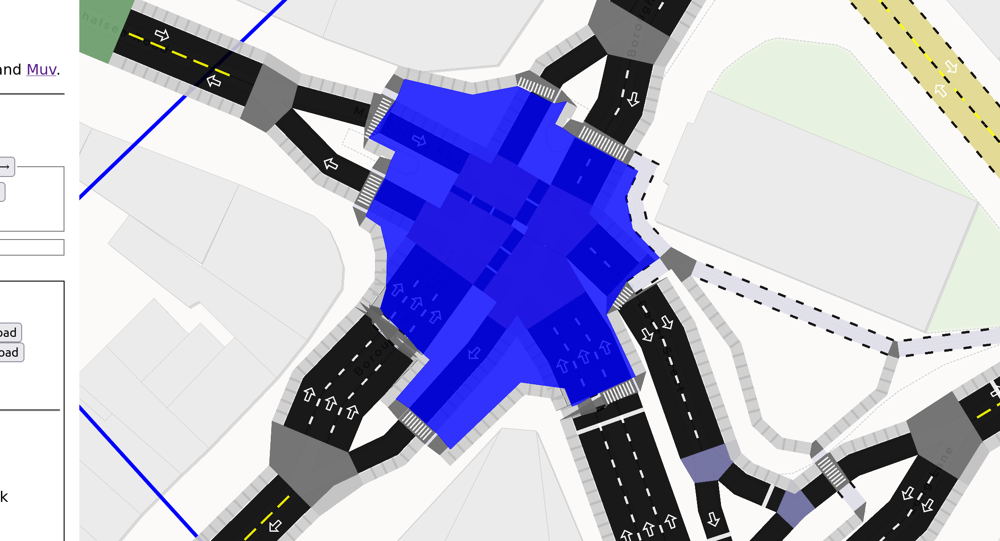

March 30, 2024

After writing up my trip last December, I had resolved to keep a journal for future trips. In the three months since, I haven't left London, but I wound up continuing with the journal, and decided to try and blog a bit more regularly. This winter has mostly just been working on many things, so time to dive right into those!

## Wrangling Excel

At work, there's been a need to use the [Active Mode Appraisal Toolkit](https://assets.publishing.service.gov.uk/media/631744188fa8f50220e60d1a/active-model-appraisal-toolkit-user-guidance.pdf) in an automated way. AMAT is an Excel tool that estimates the costs and benefits of a proposed active travel scheme, given some basic information about it. Usually people fill this out manually, but we needed to evaluate many thousands of schemes. I spent about a day foolishly optimistic, defining a nice clean input and output representation, confident there'd just be "a few formulas" to manually implement in some other language. But after realizing just how many formulas (mixed with hardcoded tables) there were, this approach soon fell apart.

So instead, I tried a few libraries that could parse and evaluate Excel, eventually settling on [HyperFormula](https://hyperformula.handsontable.com) and [exceljs](https://www.npmjs.com/package/exceljs). Though they have example code to load an XLSX file, it's far from working, and it took me a few weeks of intermittent debugging to [get something working](https://github.com/handsontable/hyperformula/issues/1392). It was kind of fun to devise divide-and-conquer strategies to find the first places where errors happened or differences between a cell in Excel vs HyperFormula appeared, but... mostly, it was a really frustrating problem to work on.

I did also start an experiment to semi-automatically "port" all of the Excel logic to a language like Rust. If you just read through every single cell in every sheet, you can output something like `let sheet4_a53 = 123.0` pretty easily, and rewrite an expression tree from a parsed Excel formula. Letting the Rust compiler look at the result is useful -- you discover unused cells naturally. I got stuck with global variables ("named ranges" in Excel) though; in AMAT's case, they often refer to some values on particular sheets, but the same sheets refer to them too, so it'd take topological sorting or something to figure out the order to define. Maybe a project for a very rainy day, but... I'd rather not.

## Other work projects

I spent most of the last few months on an internal pipeline using the above -- finding ways to generate all of the input that AMAT needs from scheme proposal data we have. We used TypeScript to do the analysis, and I'm much more aware of the pain points for using it this way now. I would probably just use Rust in the future; there's more upfront work expressing the types of all the inputs involved, but because our data was so messy and incomplete, it would've been well worth it to have proper `Option` types from the start.

I also added a few contextual layers to the [ATIP scheme browser](https://acteng.github.io/atip/browse.html), a tool used internally to visualize active travel schemes alongside many different UK datasets. I did use Rust for the input data processing here, and that feels like the right choice! Svelte, MapLibre, and PMTiles have continued to be a winning combo for very quickly getting a nice frontend to work. Some particularly cool new layers:

How steep is a street? Using open Ordnance Survey raster data and [joining to OSM center-lines](https://github.com/acteng/atip-data-prep/blob/main/gradient/src/main.rs), we can start to get an idea.

When there are cycleways next to a bus stop, when is a bypass worth it? It depends on how many buses there'll be at that stop per hour. Using an England-wide GTFS extract from the UK's awesome [Bus Open Data Service](https://www.bus-data.dft.gov.uk) and a simple [Rust script](https://github.com/acteng/atip-data-prep/tree/main/bus_frequency), we can calculat and visualize that. This finds the precise [one-hour interval](https://github.com/acteng/atip-data-prep/blob/ac2603fd04096baed6baee8cf720146f93873a28/bus_frequency/src/main.rs#L60) with the most buses, across any service and any day.

Finally, this [stats19](https://www.gov.uk/guidance/road-accident-and-safety-statistics-guidance) layer shows different types of collisions. The [data processing](https://github.com/acteng/atip-data-prep/blob/main/stats19/src/main.rs) is simple; most of the magic is in the [frontend](https://github.com/acteng/atip/blob/main/src/lib/browse/layers/points/Stats19.svelte).

## Severance Snape and the new LTN tool

I released an alpha of [Severance Snape](https://dabreegster.github.io/severance_snape), a new tool I started in December to study if an area has well-placed crossings, but haven't really touched it since. There's lots more I want to do wth this, but haven't had time.

I've made loads of progress with the new [Low Traffic Neighbourhood tool](https://dabreegster.github.io/ltn), which is **definitely** going to replace the old A/B Street version at this point. I've lost track of all the changes, but many have just been about achieving initial feature parity with the old version. One of the new bits I'm most proud of is the user flow through the app, structured into "projects." You first define a study area to import from OSM, then draw and name some neighbourhood boundaries. Only then can you make edits to modal filters, one-ways, etc. Everything you do is auto-saved to local storage, and expressed as a single GeoJSON file that's relatively future-proof, even if upstream OSM data in that area changes a bit. This structure has come from feedback and brainstorming sessions with some particularly engaged users; thanks to them!

I switched to [PicoCSS](https://picocss.com) for the LTN tool and am mostly happy with it. I've really struggled to find the right library that lets me just concentrate on the app and not fiddle with CSS endlessly. I don't buy into using the Tailwind approach in my code directly; I want Svelte components (or similar) that nicely encapsulate different types of buttons or other widgets.

I did come up with this really weird [hack](https://github.com/dabreegster/ltn/blob/main/web/src/SplitComponent.svelte) that lets me write one Svelte component that renders to different parts of the DOM -- like a top bar, sidebar, and map all from one component, [using different slots](https://github.com/dabreegster/ltn/blob/a47a440a65777c8c2233f7da1f3fa6f9d916033b/web/src/NetworkMode.svelte#L141). I'll try and write it up eventually in case it's generally useful. And probably realize I've reinvented something that Sveltekit could do more naturally anyway.

I need to find time to really focus on the LTN tool and get the MVP done; hopefully that'll be in the next months.

## od2net hackathon

There's been a bit of work on [od2net](https://github.com/Urban-Analytics-Technology-Platform/od2net), like adding support for bringing in elevation data. With Robin, Rosa, and a few other usual suspects, we had a hackathon and got [an example using R](https://github.com/Urban-Analytics-Technology-Platform/od2net/blob/main/examples/lisbon/setup.R) to generate input. There was also some excellent discussion about how to make use of the output route network in policy contexts.

## The great osm2streets revival

The most exciting work has happened in a pretty short time. [osm2streets](http://osm2streets.org) is the piece of A/B Street that has survived the best -- take OSM data and render streets and intersections in as much detail as possible. Work on it stalled out for pretty much all of last year, sadly.

But then a new contributor created [Muv](https://gitlab.com/LeLuxNet/Muv/), a Rust library for handling the absurd complexity of OSM lane tagging and giving detailed, well-typed descriptions of the lanes along a road. The Muv author then did all of the work of [hooking up osm2streets to Muv](https://github.com/a-b-street/osm2streets/pull/233), fixing problems just about as fast as I could report them. Spurred on by this energy and the excitement of suddenly having a bunch of bugs in osm2streets taken care of, I started playing catch-up:

- porting the web app to [svelte-maplibre](https://github.com/dimfeld/svelte-maplibre/) and pulling in all the useful tricks I've learned in the past year, like switching basemaps, opening Streetview/Bing quickly, making ergonomic tweaks everywhere
- rendering more [lane and intersection markings](https://github.com/a-b-street/osm2streets/pull/241) from A/B Street directly in MapLibre
- fixing some cases where [intersection geometry failed](https://github.com/a-b-street/osm2streets/pull/245) and blew up everything downstream

Then some exciting new stuff happened! Thanks to my slightly better understanding of how crossings are tagged in OSM from working on Severance Snape, I started [rendering zebra and unmarked crossings](https://github.com/a-b-street/osm2streets/pull/247). Then, looking at places where sidewalks and crossings are explicitly mapped as separate objects in OSM, ideas from the LTN tool and route snapper began to surface. The [negative space](https://github.com/a-b-street/osm2streets/pull/250) in between dual carriageways, the side of a road and a sidewalk, and so on can all be traced pretty easily, assuming osm2streets gets the basic road and intersection geometry halfway decently. If that tracing is restricted to just look at sidewalks and crossings, then [something very cool emerges](https://github.com/a-b-street/osm2streets/pull/251) -- a way to group a subset of the OSM graph into "bundles" of roads with their side-paths, and into complex junctions.

There's much more work needed to solidify these early experiments, but I think being able to bundle together bits of OSM graph like this has many uses. It deserves a blog post of its own, to describe how everything works, and how easy it'd be to implement from scratch (osm2streets is a complex codebase, but this idea is doable on top of any simple OSM-based graph structure).

Reflecting on why all this progress has happened so quickly, I think the long pause on osm2streets was actually useful. I started other projects since then that don't use osm2streets at all and re-think what's necessary. osm2streets is still burdened by weird old assumptions I made early for the traffic simulation piece of A/B Street, and starting fresh in Severance Snape and the new LTN tool has been handy. A/B Street's lane editor still couldn't handle separate OSM sidepaths. But maybe the right approach is to still parse and render them as accurately as possible in osm2streets. Then use this new logical bundling to create a simpler representation that's more easily editable.

## Some other forgotten bits

I've also done some work on the [route snapper](https://github.com/dabreegster/route_snapper/pull/49) and started [refactoring some Svelte code I've been shamelessly copying everywhere](https://github.com/dabreegster/maplibre-draw-polygon). But I think in net, I've accrued more technical debt the past 3 months than paid down, and well, that's life.

## Just life

I feel like I did so many interesting non-computer things in December, but these last three months have been comparatively quite simple. The magic of living in London has worn off some days -- but that's a fluid feeling. I haven't done as much aimless wandering as I used to, but... I think there's a decent reason for that.

I realized last December that I need to live near mountains to satisfy my inner monkey, a place where I can scramble and get lost and play. I don't have that here. So in January, I joined a gym that had calisthenics classes. Since the monthly membership is far from cheap, I decided to try as many different classes as I could that first month -- almost every day! Calisthenics was fun, but pretty quickly it became clear my real movement passion is aerial/circus -- hoop and trapeze particularly. I've never done these before (though I have a little experience on pole -- but that's a story for another time...) Hoop has struck the absolute perfect balance for me -- I had enough base strength from parkour to breeze through the initial difficulty curve, but it's _finally_ something challenging and new that I can dump my energy into and see regular break-throughs, **without** risking more knee injury. A feeling I've missed from parkour for years -- systematically working through fear and achieving a new movement -- is back. It feels like every few days I have a new victory -- hocksing on one leg and taking the other off, an elbow roll on trapeze, the infinity roll on a hammock, a Russian split on hoop. I'm addicted, getting stronger and more confident, and getting proper exercise again. Why didn't I start this **years** ago?

And then maybe a bit over a month ago, I joined an acroyoga group. This has been such a mind-game -- I'm used to moving in the air and inversions already, but always using my own strength, trusting only myself and whatever I'm climbing. Acroyoga is fundamentally about trust and communication between a base, flyer, and spotter. It has been utterly bizarre to me how there's some kind of movement I definitely can't do by myself, but with two more experienced friends, it suddenly just works. I'm in love with it; the three hours every week are some of my most meaningful in recent memory. I approached it expecting to focus on basing, since I was skittish about flying with my knee. But actually so far, I think I'm progressing the most with flying and spotting. I want to become a better base, but there's lots of conditioning to do to get there -- and what an awesome motivation to do that work!

There's an art to writing a good conclusion and not just cutting off, but... it's time for dinner.
