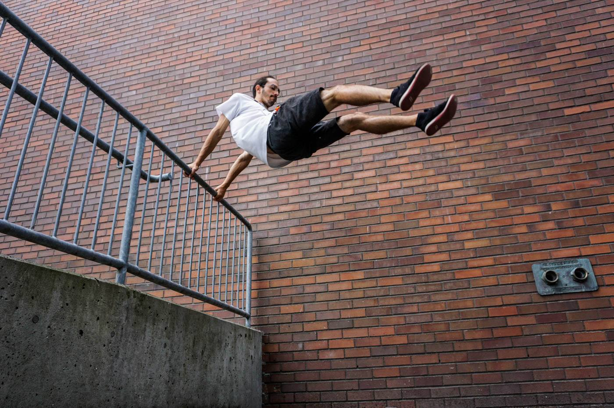
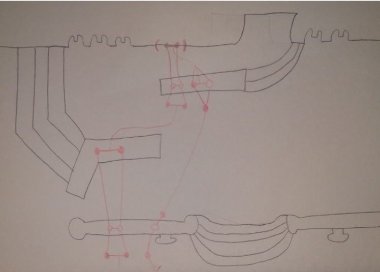

<video width="480" height="480" controls="controls">
  <source src="library.mp4" type="video/mp4">
</video>

I've been practicing parkour since December 2015. I started learning with [Parkour Visions](https://parkourvisions.org), and was part of the formation of [Seattle Jumps](https://www.instagram.com/seattlejumps), a tight-knit community with regular meetups. I've met many of my best friends locally through it, and have had the pleasure of training with groups across 5 countries. I've learned a fair bit about myself, mind and body, and the nature of fear along the way.

So what is parkour -- it's that crazy sport where people huck themselves off of buildings, right? Not at all -- [this video](https://www.youtube.com/watch?v=w-2i3STn6bQ) is the best explanation to start with. My own movement style has changed over the years, most recently focusing on [flowy movement](https://www.instagram.com/p/B4jVcXMAw9a/) and [squeezing through tight spaces](https://www.instagram.com/p/CKaTLPQFK_j/).

## Videos

A huge part of parkour culture is filming lines. Here are some of my favorite works!

- [The Quiet Months](https://www.youtube.com/watch?v=aClI0OsJ6oQ): at the beginning of the pandemic, I returned to solo training and started breaking many jumps I had been eyeing for years.
- [Summer 2019](https://www.youtube.com/watch?v=PpPyGBRW8S4): probably my most upbeat lines
- [Évry Move](https://www.youtube.com/watch?v=dlsyDEjyZc4): in 2019, I had the pleasure of meeting the original founders of parkour at a workshop in Évry, France.
- [Japan, 2019](https://www.youtube.com/watch?v=U6v06BqlOJU): this is less a parkour video, and more a love letter to the spaces in Tokyo, Kyoto, Osaka, Nikko, and Miyazaki.
- [Bleeding Water](https://www.youtube.com/watch?v=5xFsTmrrjds): in which I come to a sort of reckoning with my hometown, Baton Rouge.
- [Texas Winter Jam](https://www.youtube.com/watch?v=6E4EF7Ab6MQ): I went to college in Austin, but somehow didn't start parkour while I lived there! Luckily, I went back.
- [May 2019](https://www.youtube.com/watch?v=hAEtro2kfEg): contains the only bail I've ever caught on film.

## Maps

I stumbled into my current project because I've loved maps all my life, so of course at some point I tried to combine parkour and cartography. [Move fast and map things](move_fast_and_map_things.pdf) is a talk I gave at the Art of Retreat in 2018 about notations for representing parkour-conducive spaces and movements through them.

## Join me!

Open offer: if you're ever passing through Seattle and want to try parkour, ping me! I've taught dozens of people their first lesson. "It's dangerous" is a shaky excuse -- proper parkour is all about progressing at an appropriate pace and managing risk. I won't stand for "I'm not in shape" -- you can start anywhere, and parkour is a **fun** way to exercise. Paraphrased by a friend Brandee Laird: everybody moves; parkour just helps you move better.

If you're interested in trying it out in your own area and can't find anybody to practice with, I might also be able to help find your local community.

(And in case anybody takes me up on the offer while COVID's still a concern: we'd practice outside with masks in a way that we're both comfortable with.)
