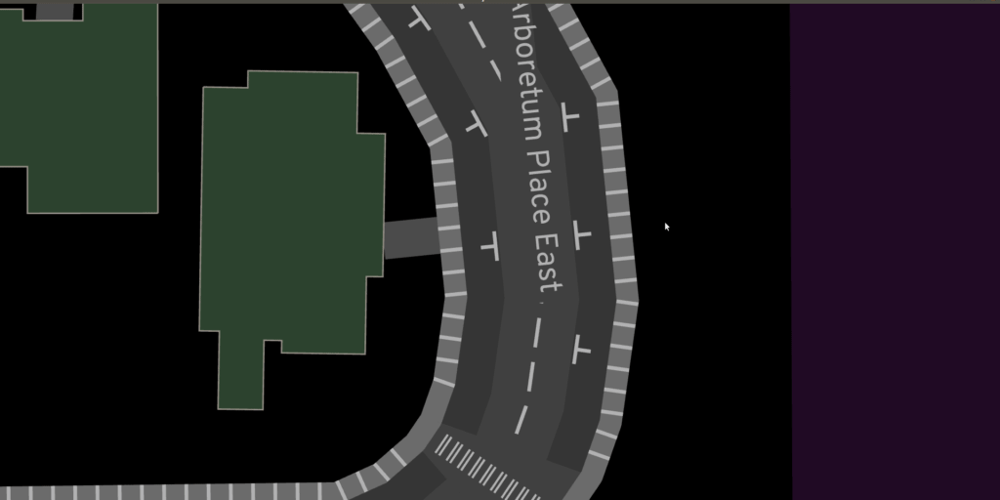

The suspense elongates like a bus forever curving
along a most circuitously electric route.
This frustrated tension and brief relief I can't articulate
oh, but the bus can.

Who _is_ waiting just around the river bend?
Another simulacrum flickering between centroids of digital hint,
presupposing themselves along too many seats,
smearing the windows with my latest dredged wounds.

and, perhaps more importantly,
who is it that's perched strategically by the mid-row exit,
finger poised to tug the cord and alight,
but also ready to settle in and take in the sights?

Slinky, collapse! Prolonging longing is nice and all,
but this time, I'll just walk.
