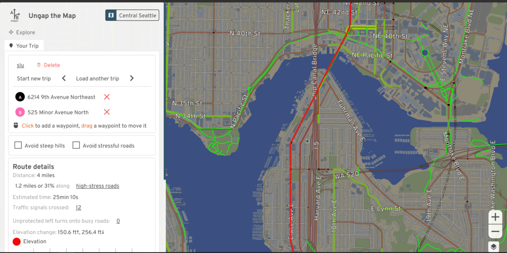
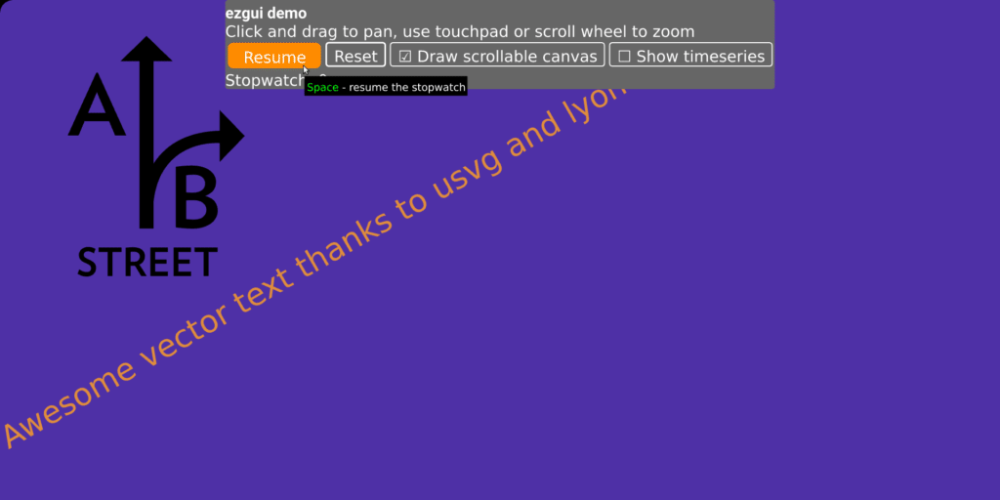
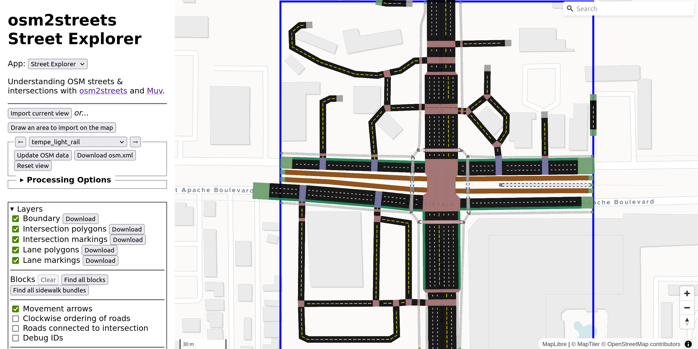

WIP. Running Jekyll locally is hitting dependency hell, so deploying is the way to test for now.

## A/B Street platform, first generation

### A/B Street traffic simulator

The project that started it all.

- Simulate individual cars, pedestrians, cyclists, and buses anywhere in the world with OpenStreetMap
- Edit lane configuration and traffic signal timing
- Run A/B tests with those edits and measure effects on individual agents and aggregate groups
- Includes a gamified tutorial mode to teach the controls

TODO: the poundbury animation
TODO: youtube trailer

- [Site](https://traffic.abstreet.org)
- [Code](https://github.com/a-b-street/abstreet/tree/main/apps/game)
- Audience: The general public, to explore and propose changes to their city. Government agencies and campaign groups, to communicate proposals more interactively.
- Status: Unmaintained, with no future plans. Very buggy; getting a "realistic" baseline simulation that doesn't crash or gridlock is challenging.

### Ungap the Map

Quickly sketch improvements to a bike network and evaluate the benefits

- [Site](https://bike.abstreet.org)
- [Code](https://github.com/a-b-street/abstreet/tree/main/apps/game/src/ungap)
- Audience: The general public and transport professionals
- Status: Usable, but in maintenance mode. od2net is the spiritual successor.

### The 15 minute neighbourhood tool

Use isochrones to explore what shops are a short walk away from where people live.

- [Site](https://15m.abstreet.org)
- [Code](https://github.com/a-b-street/abstreet/tree/main/apps/fifteen_min)
- Status: Usable, but in maintenance mode. A new version is underway. There are big limits with the pedestrian pathfinding; Severance Snape is a newer project focusing on those.

### 15-minute Santa

An arcade game where Santa delivers presents and uses the Christmas magic of upzoning to improve land use patterns.

- [Site](https://santa.abstreet.org)
- [Code](https://github.com/a-b-street/abstreet/tree/main/apps/santa)
- Audience: Anybody! I've heard happy things particularly from younger children, and middle/high school teachers using this in class
- Status: Done! (The only project I consider truly complete.)

### The low-traffic neighbourhood (LTN) tool

Explore how modal filters can solve the problem of drivers cutting through residential areas

- [Site](https://ltn.abstreet.org)
- [Code](https://github.com/a-b-street/abstreet/tree/main/apps/ltn)
- Audience: The general public and transport professionals. This is my most-used project; over 30 councils, consultants, and individuals in the UK and other countries are using it.
- Status: Usable, but with some big limitations around neighbourhood boundaries. A new version is "nearly" ready to replace this.

### Parking mapper

A tool to more quickly update OSM with street parking

- [Site](https://a-b-street.github.io/docs/software/parking_mapper.html)
- [Code](https://github.com/a-b-street/abstreet/tree/main/apps/parking_mapper)
- Audience: OSM mappers
- Status: Usable, but abandoned. Use [zlant's tool](https://zlant.github.io/parking-lanes) instead.

### OSM viewer

An OSM data exploration tool

- [Site](https://a-b-street.github.io/docs/software/osm_viewer.html)
- [Code](https://github.com/a-b-street/abstreet/tree/main/apps/osm_viewer)
- Audience: OSM mappers
- Status: Usable, but abandoned. [Overpass](https://overpass-turbo.eu), QGIS, [osm2streets Street Explorer](https://osm2streets.org), etc are better.

### widgetry

A 2D drawing and UI Rust library for native and web that powers all of the A/B Street apps

- [Code](https://github.com/a-b-street/abstreet/tree/main/widgetry)
- Audience: Rust developers
- Status: Used in all A/B Street apps, but abandoned. All of my current projects are targeting web only, using Svelte and MapLibre instead. See [Are we GUI Yet?](https://areweguiyet.com) for Rust UI libraries.

### osm2streets

- Transform OSM data to a detailed geometric and semantic representation of streets, intersections, and turns.
- Primarily a library callable in Rust, JS, or Java
- Has a Street Explorer web app to visualize results
- Has a lane editor app to fix OSM tagging

- [Street Explorer](https://osm2streets.org)
- [Lane editor](https://a-b-street.github.io/osm2streets/lane_editor.html)
- [Code](https://github.com/a-b-street/osm2streets)
- Audience: OSM mappers and software developers
- Status: Active development. Powers all A/B Street apps.

## Modern web-based projects

Around mid 2022, I gave up on developing UIs with the custom OpenGL widgetry library, and started creating web-only projects using [Svelte](https://svelte.dev), [MapLibre GL JS](https://maplibre.org), often with a WASM "backend" written in Rust.

### od2net

Transform origin/destination data about where people travel into a cycling network plan, showing the most-used roads under different assumptions. It calculates many routes extremely quickly, and also has an interactive web tool for tuning route preferences.

- [Site](https://od2net.org)
- [Code](https://github.com/Urban-Analytics-Technology-Platform/od2net)
- Audience: Transport professionals and researchers
- Status: Usable and under active development

### The low-traffic neighbourhood (LTN) tool v2

Same as the LTN tool v1 -- explore how modal filters can solve the problem of drivers cutting through residential areas. This is a rewrite of v1, with major improvements.

- [Site](https://a-b-street.github.io/ltn)
- [Code](https://github.com/a-b-street/ltn)
- Audience: The general public and transport professionals
- Status: Still not as feature-complete as v1, but fixes many problems and already usable. Under active development.

### The 15 minute neighbourhood tool v2

A rewrite of the v1 tool -- use isochrones to explore what points of interest are within a short walking, cycling, or public transit range of where people live. Includes a prototype of a public transit GTFS router.

- [Site](https://a-b-street.github.io/15m)
- [Code](https://github.com/a-b-street/15m)
- Audience: The general public and transport professionals
- Status: Pre-alpha, under active development

### Severance Snape

A tool to study how far pedestrians have to detour to cross large roads and other severances.

- [Site](https://a-b-street.github.io/severance_snape/)
- [Code](https://github.com/a-b-street/severance_snape)
- Audience: The general public and transport professionals. I've personally used this to quickly understand where I might want to wander in unfamiliar places.
- Status: Alpha, under active development

### Route snapper

A MapLibre plugin to draw routes and areas that snap to an existing road network. The routing happens in-browser for a fixed study area. Networks can be built from OpenStreetMap or custom sources.

- [Demo in one small area](https://dabreegster.github.io/route_snapper/)
- [Code](https://github.com/dabreegster/route_snapper/)
- [NPM package](https://www.npmjs.com/package/route-snapper)
- Audience: Developers
- Status: Ready for use, released on NPM

### ATIP Scheme Sketcher

A web tool to sketch proposed walking/cycling/wheeling infrastructure on a map and fill out forms to describe it. More generally, an alternative to geojson.io, Felt, and other map drawing platforms.

- [Site](https://acteng.github.io/atip)
- [Code](https://github.com/acteng/atip)
- Audience: Government agencies with plans to describe, but usable for many purposes
- Status: Has been used at large scales. Active development (my day job)

### ATIP Scheme Browser

A web map bringing together over 30 contextual layers for evaluating proposed active travel schemes (collected by the Scheme Sketcher). Specialized for England, but generalizable for some layers.

- [Site (no scheme data and only public layers)](https://acteng.github.io/atip/browse.html)
- [Frontend code](https://github.com/acteng/atip)
- [Code to produce layers](https://github.com/acteng/atip-data-prep)
- Audience: Currently just an internal audience, but the public version could have many use cases
- Status: Actively used, and under active development (my day job)

### ATE Inspectorate tools

A web rewrite of three Excel-based tools developed by ATE for assessing and designing active travel schemes.

- [Site](https://acteng.github.io/inspectorate_tools)
- [Code](https://github.com/acteng/inspectorate_tools)
- Audience: Internal, eventually local authorities
- Status: Experimental, active development (my day job)

### GeoJSON Viewer

Exploratory data analysis of GeoJSON data, with convenient filtering and symbolizing based on arbitrary properties.

- [Site](https://dabreegster.github.io/geojson-viewer)
- [Code](https://dabreegster.github.io/geojson-viewer)
- Audience: developers and data scientists
- Status: Usable (I made this for my own debugging convenience, and it's already more convenient than alternatives for me personally)

### GeoDiffr

Interactively explore the difference between two GeoJSON files. The diff could represent a test case changing, OSM data changing over time, etc.

- [Site](https://dabreegster.github.io/geodiffr)
- [Code](https://github.com/dabreegster/geodiffr)
- Audience: developers and data scientists
- Status: Usable (I made this for my own debugging convenience, and it's already more convenient than alternatives for me personally)

## Experiments

### Bus Spotting

View GTFS data interactively (like visualizing routes that run just on a weekend) and match real GPS traces and bus ticketing events to the schedule. The GTFS viewer portion is partly superceded by the 15-minute tool v2.

- [Code](https://github.com/dabreegster/bus_spotting)

### lines2pmtiles

Convert GeoJSON points and lines to [PMTiles](https://docs.protomaps.com/pmtiles) in Rust. An alternative to [tippecanoe](https://github.com/felt/tippecanoe) that could run in the browser with WASM. Some initial results, but needs much more work.

- [Code](https://github.com/Urban-Analytics-Technology-Platform/lines2pmtiles)

### odjitter

Turn aggregate zone-level origin/destination data into specific "disaggregated" flows.

- [Code](https://github.com/dabreegster/odjitter)
- Audience: data scientists
- Status: Usable, but abandoned. Use od2net instead.

### Polygon widths

Attempting to measure the width along irregular road and pavement polygons with high granularity, using Voronoi straight skeletons.

- [Code](https://github.com/dabreegster/polygon-width)

### Will it fit?

Given highly detailed width data (from polygon-widths or similar), a route, and the width required by different cross sections, figure out which cross sections will fit along different parts of the route. Identify "pinch points" where nothing fits. This will eventually become part of the inspectorate tools cross-section check, if successful.

- [Code](https://github.com/acteng/will-it-fit)

### Others

- [Temporal city](https://github.com/dabreegster/temporal_city): Looking at OSM opening hours to see what parts of a city are lively at night or early on a Saturday
- [SVG face](https://github.com/dabreegster/svg_face): Generate random SVG faces for A/B Street
- [Canvas geometry](https://github.com/dabreegster/canvas_geometry): Exploring if road width can be calclated from OSM building footprints, and trying out SVG rendering

## Libraries

Aside from route-snapper and osm2streets, these're smaller libraries in support of larger projects.

- [country-geocoder](https://github.com/a-b-street/country-geocoder): given a WGS84 point, reverse geocode into the country and direction of traffic
- [elevation](https://github.com/dabreegster/elevation): build on pure Rust crates to read elevation from GeoTIFFs
- [osm-reader](https://github.com/a-b-street/osm-reader): read OSM XML or PBF interchangeably in Rust
- [utils](https://github.com/a-b-street/utils/): common Rust code that's yet to be upstreamed elsewhere or properly split out
- [svelte-utils](https://github.com/a-b-street/svelte-utils): common Svelte code yet to be properly split out into a library
