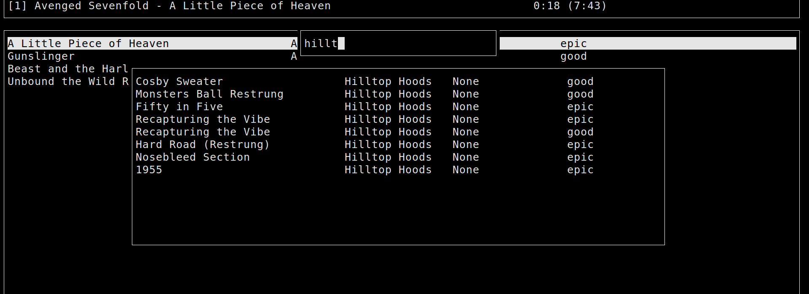

I really need to get some of these running again and put them online...

## Transportation

[A/B Street](abstreet.org) is my current main focus. I've written plenty about it elsewhere, but maybe you're particularly looking for [its backstory](https://a-b-street.github.io/docs/project/history/backstory.html)...

[AORTA](https://github.com/dabreegster/aorta/) was my undergrad [thesis](http://apps.cs.utexas.edu/tech_reports/reports/tr/TR-2157.pdf) at UT Austin. Using the Approximately Orchestrated Routing & Transportation Analyzer, I once asked, [what if vehicles could bid in auctions to turn a traffic light green faster...](https://ieeexplore.ieee.org/abstract/document/6728285)

## Games

I originally started programming to try to make games. Using a roguelike engine I built in Perl over many years, the most polished game from high school was called MnemonicRL. When I get [the code](https://github.com/dabreegster/mnemonicrl) running again, I'll put up more pictures, but in the meantime, here's the [trailer](https://www.youtube.com/watch?v=lsQC9reFbdQ).

The summer between college and work, I started Hotel Solipcyst, a game based on [an old poem](../poetry/high/hotel_solipcyst.md). The concept was that disasters stack -- even if the hotel catches fire and all guests are poisoned, you (the butler) forge on through the time-looping day, slowly manipulating people's schedules... The project is in Scala, and when I get it running again, I'll put it online.

The only game that I've ever actually finished in any real sense is [15-minute Santa](santa.abstreet.org) -- so go play it!

## Mapping

First semester of college, I hand-mapped UT Austin's campus and threw together a Perl script and web UI to find optimal routes between classes. There's at least a [screenshot](https://a-b-street.github.io/docs/project/history/backstory.html) here.

Possibly my first winter in Seattle, I learned OpenGL by making a 3D OpenStreetMap renderer in Scala, complete with falling snow. The project's name is entirely inappropriate. When I get the code running again... I'll scrub all references to that lewd nomenclature.

## My origin story

The first real program I wrote was the Jigstar Music Daemon, or JMD, and I still use it to this day. When I'm playing all of my music on shuffle, sometimes I'm reminded of a particular band I haven't heard in a while. I want to go listen to their stuff, but not lose my place in the original shuffle. So I want a stack of queues as my playlist. Somehow in ~2004, I couldn't find anything to do this on Linux, so I put all those computer books from the library to good use and started learning enough Perl to get this working. I think it probably took a while (and so many questions on the #perl and #perlcafe channels from Freenode!), and the first version didn't have NCurses or SQLite support, but I'm quite pleased with how it turned out.

