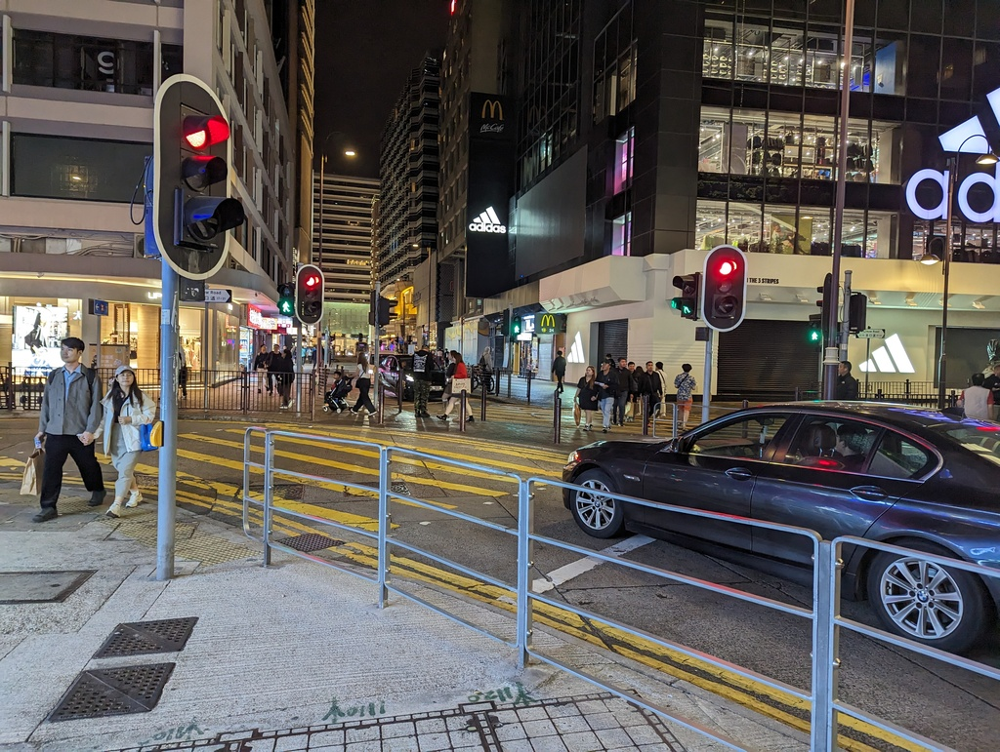
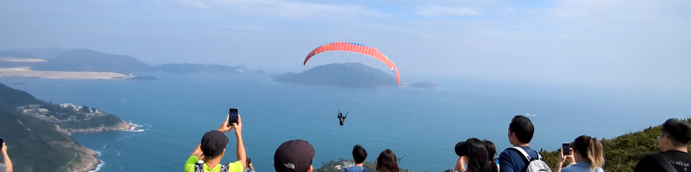

# December 2023 trip, part 1: Hong Kong

1 January, 2024

All photos are [CC BY-NC-SA](https://creativecommons.org/licenses/by-nc-sa/4.0/). I compressed a bunch; [email me](mailto:dabreegster@gmail.com) if you want originals.

## Introduction

I don't like to write regularly, so when I do, it's not short. I've previously written a [reflection on 3 years of A/B Street](https://a-b-street.github.io/docs/project/history/retrospective/index.html) and a [technical lookback on 2022](https://a-b-street.github.io/docs/project/history/vision_and_validate/index.html). This year is different -- this post is about a month-long trip I took to Hong Kong, Japan, and Korea. I'm finishing writing it back in London, but it's sourced from an ~11,000 word daily journal and too many photos. I don't really know who the audience is -- I kept that journal and am writing this reflection for personal reasons, but I'm happy to share this cross-section of my life with anyone curious.

### Context

I didn't travel much at all growing up, and it took a while to leave the US. But in 2019, in the middle of my 3 years of solo focusing on A/B Street, I took two month-long trips: one to attend a workshop by the founders of parkour (winding up in Paris, London, and Berlin) and another in Japan. Both times, my main record of the trips was a video mostly focused on parkour during the trips, but with plenty of b-roll ([Europe](https://www.youtube.com/watch?v=dlsyDEjyZc4), [Japan](https://www.youtube.com/watch?v=U6v06BqlOJU)). I wish I had travelled much more during 2018 and 2019, when I had the time and means. If I had known what 2020 would be...

Then after moving to London at the end of 2021 and starting a job, I wasted most of my generous holiday time in 2022 (not counting Taiwan!). I wasn't used to being on a work schedule again, and I was used to reasoning about the puny 2 or 3 weeks from jobs in the US. So for 2023, I strategized a bit and decided to save most for the end of the year. Summer holidays are common in the UK, but the Europe heatwaves warded me off. It would be a winter trip instead, and I definitely wanted to return to Japan.

The tone of this trip started _very_ differently than the ones in 2019, epitomizing some changes in my life since then. 2019: the last innocent year, of course. I tore my ACL doing parkour in early 2020 and have had a very bumpy time since -- surgery, a re-tear, many rounds of physio, but repeated re-injuries. I've of course adapted how I practice the sport, but my problem is never with focused moments on difficult challenges. It's always a brief moment of distraction that does me in. It had been months since my last reinjury (from stepping off a bouldering wall without priming my knee -- not falling, just stepping down from a hold in a dumb way)... and somehow a week before leaving for Hong Kong, I was visiting my favorite willow tree in York and absent-mindedly slid on mud a funny direction. I knew immediately this was a worse re-injury than the previous ones; it wasn't just the usual crunch and sudden collapse. There was a twist in a different direction, and finally an experience of actual pain (all the previous tears and my experience with surgery were all completely pain-free). By the morning of my flight, I was down to one crutch and my "trusty" knee brace (it's garbage at preventing re-injury, but definitely nice when I need to bear less weight right after). I didn't want to lug around the crutch the whole trip, but... it was necessary that first week.

So things had started out quite bumpy, but it got worse. I picked up a brutal cold in Hong Kong (not surprising; it felt like about 40% of people there were sniffling or coughing). It's pretty normal for me to have a day full of nosebleeds at the end of a cold, when my nose stops running so much. But this time, the nosebleeds were on and off for nearly a week, with some pretty heavy ones awkwardly striking in the middle of having a meal or when I'm in the middle of a crowd, nowhere near a sink.

And then on the flight from Hong Kong to Tokyo, both my ears block up. I've never had problems with ears popping before, but I think the nasal congestion was really badly timed. I landed and had maybe 30% of my hearing. I remember being Tokyo being incredibly quiet for such a populated city, but this was an even more disorienting experience. And I had quite a time my first day remembering how to speak Japanese without being able to hear myself.

But anyway, that's all the hardship out the way. I immensely enjoyed the trip; these were just the hiccups. Let's get into the real story now.

## Hong Kong (7 days)

### Life as a pedestrian

I think especially because I was still hobbling with the crutch my first few days, adjusting took some time. Navigating by direction doesn't work as a pedestrian; you frequently hit a huge road with no nearby crossings. And when you do find a crossing, it often involves stairs.

Finding anything was also challenging -- because so many things are inside some complex 3D mall. It makes aimless wandering harder, because you can't window-shop and gauge something quickly from the street. Does this massive complex have a food court inside? It'll probably take a few minutes to walk in and figure it out, and you might not be able to exit the building in the spot you want. I particularly remember this when I left the station in Admiralty only to find myself fenced in by highways on all sides. It took a few minutes to realize the pedestrian world here is all indoors, find the right escalator, and return to the happy path.

All of this got much easier with a few day's familiarity, of course.

<figure><figcaption>Subways and bridges are both pedestrian anti-patterns, massively inconvenient.</figcaption></figure>

<figure><figcaption>I slightly prefer bridges, because you can at least still orient with the streetscape. You go down and up either way.</figcaption></figure>

<figure><video controls width="800"><source src="hk/navigation/severance.mp4" /></video><figcaption>This was one of the most ridiculous severances I found. Directly west of Victoria Park are a bunch of nice food shops, but if you want to walk across the street to enjoy your treat, you'll be walking for a bit.</figcaption></figure>

I had the chance to grab coffee with two members of [Street Reset](https://streetresethk.org) and chat about their vision for improving the pedestrian experience in HK.

<figure><figcaption>One of the rare examples of a severance for cars and a shortcut for pedestrians -- a diagonal crossing in TST.</figcaption></figure>

### Dragon's Back

<figure><figcaption></figcaption></figure>

Some London friends were also in HK at the same time, so we took a lovely hike up Dragon's Back. We covered so much ground in a few hours; HK feels really tiny two-dimensionally.

<figure><figcaption>We happened to spot a paraglider launching on the way down</figcaption></figure>

<figure><figcaption>On the way back in Stanley, perhaps fittingly we met a real dragon, whose name I think was "idiot" in Cantonese</figcaption></figure>

## Victoria Peak

I walked to the top from Central. I love steep uphills (and might've surprised a few people by casually ascending with the brace and crutch) and hate downhill, so taking the tram for the way down was perfect.

<figure><video controls width="800"><source src="hk/victoria_peak/cat.mp4" /></video><figcaption>A staircase guardian demands attention before allowing passage</figcaption></figure>

<figure><figcaption></figcaption></figure>

<figure><figcaption>The tram line going up</figcaption></figure>

<figure><figcaption>Seeing the same building from its ground floor and up here really gave a sense of scale</figcaption></figure>

<figure><figcaption>The building's penthouse and this bit of forest have a mutually nice view of each other</figcaption></figure>

### Chungking Mansions

Completely unintentionally, I wound up staying at a [famous building](https://en.wikipedia.org/wiki/Chungking_Mansions). I guess if you go for cheap housing, this is pretty inevitable -- just [take a look](https://www.openstreetmap.org/way/39315991) at how many guesthouses are crammed in one place. The first day or so, getting in or out from my guesthouse was a matter of memorizing landmarks and turns on the ground floor maze. I got a bit interested in indoor mapping the space and finding connections between the tower blocks, but ran out of time.

<figure><figcaption>The lifts were slow and crowded, and besides, if you take the stairs, you'll miss the... stains in the corners.</figcaption></figure>

<figure><figcaption>Negative space between the tower blocks. This was daytime and the sky was up there somewhere, but good luck seeing it with the shadow</figcaption></figure>

<figure><figcaption>One of the market alleys at night -- now imagine this crammed with people</figcaption></figure>

<figure><figcaption>This feels like a gross oversimplification given the real experience in there. I guess that's the job of any abstraction, to pick details to drop.</figcaption></figure>

<figure><figcaption>This sums up the delightfully grungy aesthetic of Chungking</figcaption></figure>

### Food

<figure><figcaption>Cheap truffle soup dumplings in TST</figcaption></figure>

<figure><figcaption>I love congee so much (it kind of reminds me of grits), though juk in Seoul would later topple it from ranking</figcaption></figure>

<figure><figcaption>My work friends brought me to one of the few dim sum places that still use trolleys</figcaption></figure>

### Bike ride

My work friend forewarned me that HK isn't cycling-friendly, but actually, the only ride my entire trip happened here... or at least nearby. By recommendation, I rented a bike and went from Tai Wai to Plover Cove dam and back.

<figure><figcaption>It was refreshing to see this, after seeing a grand total of 5 bikes anywhere in HK</figcaption></figure>

<figure><figcaption>Kind of feels like the buildings are competing with the mountain and losing</figcaption></figure>

<figure><video controls width="800"><source src="hk/bike_ride/bagpipes.mp4" /></video><figcaption>I was NOT expecting bagpipes in HK</figcaption></figure>

<figure><figcaption></figcaption></figure>

<figure><figcaption></figcaption></figure>

<figure><figcaption></figcaption></figure>

### Did I really leave London?

There some snippets of HK's British history that were fun to spot.

<figure><figcaption>A suspiciously familiar design for a wayfinding sign</figcaption></figure>

<figure><figcaption>A Fortnum and Mason branch on the harbour</figcaption></figure>

<figure><figcaption>The other reason to use the Chungking Mansions stairwells is to not miss this newsflash</figcaption></figure>

### Hong Kong University and a sense of scale

Towards the end of the week when I could walk more comfortably, I made the trek up HKU. Only then did the sense of vertical scale in HK kind of hit me. Understanding the density felt overwhelming. It's like the sensation of imagining how much data would be needed to represent and do a physics simulation of all the jagged rocks on a beach. What would it mean to collect floor plans of every single building in even a tiny chunk of HK?

<figure><figcaption>From the bottom of just one little staircase</figcaption></figure>

<figure><figcaption>And from the top</figcaption></figure>

<figure><figcaption></figcaption></figure>

### Things that caught my eye

<figure><figcaption>Imagine living in the middle</figcaption></figure>

<figure><figcaption>K11 art mall</figcaption></figure>

<figure><figcaption>The infamous Yick Cheong "Monster Building"</figcaption></figure>

<figure><figcaption></figcaption></figure>

<figure><figcaption>That negative space looks underutilized to me</figcaption></figure>

<figure><figcaption></figcaption></figure>

<figure><figcaption>Reminded me of Taiwan</figcaption></figure>

<figure><figcaption>Nothing in HK is visually simple</figcaption></figure>

### Moments

To end, a few memories from my journal:

- Around Temple Street in the daytime, every few buildings there's a shop with an insane configuration of densely packed machine parts, with a human or two crammed in as well. Reminded me of my dad's junk room.
- When I was stepping off a train in TST one of the first days, my work friend happened to spot me. The odds of being at exactly the right train car and platform at the same time...
- When I was doing some calisthenics in Victoria Park, there was a slight unspoken turf war between an older calisthenics guy and some kids trying to play. I always yield to children at parks, but watching this was funny.
- Taking the narrow "staff entrance" to a noodle place in Stanley

## What's next

This first part comes off as kind of impersonal, not story-like. I think that's reflective of how I felt on the first week of the trip -- a bit exhausted from adapting to everything. And of course there's plenty of thoughts from my journal that week that I'm not echoing here.

I originally wanted to finish writing about my entire month and release everything all at once, but then the caffeine wore off... stay tuned for part 2 about Japan!
