# December 2023 trip, part 2: Tokyo

2 January, 2024

All photos are [CC BY-NC-SA](https://creativecommons.org/licenses/by-nc-sa/4.0/). I compressed a bunch; [email me](mailto:dabreegster@gmail.com) if you want originals.

- Part 1: [Hong Kong](pt1_hk.md)
- Part 2: Tokyo
- Part 3: [Takayama](pt3_takayama.md)
- Part 4: [Karuizawa](pt4_karuizawa.md)
- Part 5: [Kyoto and Narita](pt5_kyoto.md)
- Part 6: [Seoul](pt6_seoul.md)
- Part 7: [Reflections](pt7_reflections.md)
- Part 8: [Technical projects](pt8_tech.md)

## Introduction: Tokyo (6 days)

My first day in Tokyo back in 2019, I happened to see somebody directing buses into a bus bay. He was wearing white gloves and somehow his body language felt so polished and professional; it just struck me. This year on the (extremely roomy) Skyliner from Narita airport, there was somebody in the train without a ticket. The ticket checker was similarly gloved and somehow managed to conjure the guy out of his seat and off to pay a fine or whatever, without any speaking, just immaculate gloved flourishes. Maybe I aspire to something like that, one day.

I really enjoyed Japan in 2019, but round two was even better. Part of it was shifted priorities -- one of my main goals in 2019 was to wander around and find parkour spots. I didn't find many, but I had a great time exploring anyway. This time, I was just in it for the semi-aimless wandering, and boy did it deliver. The other reason this time was more fun was having a bit of prior experience and expectations. One of the first things I did was find a 100 yen shop and get some kind of small coin bag, so that I could quickly and competently produce exact change the rest of the trip. Along with being able to speak the basics and quickly read katakana on a menu, I felt a small amount of pride of mastering my environment, in contrast to being pretty helpless language-wise in Hong Kong and Korea.

<figure>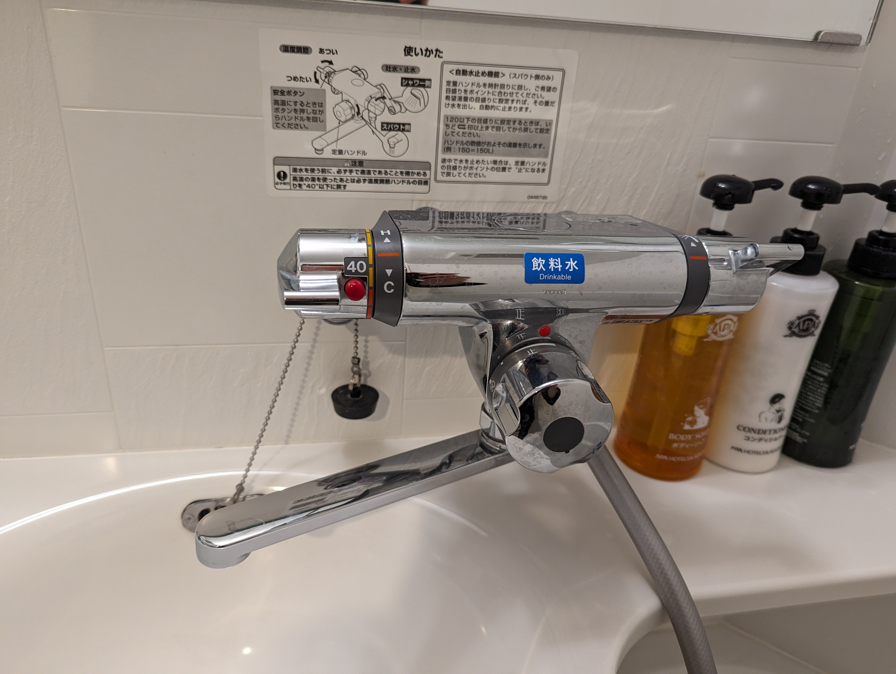<figcaption>Many things in Japan can feel initially overwhelming, like this elaborate set of instructions for a sink/shower, but if you just fiddle around a bit, it all makes sense quickly enough</figcaption></figure>

## To the ENT

But as I mentioned in part 1, I got airplane ear on the way in and could barely hear anything. So my first morning, I found my nearest ENT who could speak English and wandered in without an appointment. About 40 minutes later, I left with my inner ear infection diagnosed, medicine to treat it (which worked within a day), and clear instructions what to do. It cost about 100 USD without any kind of insurance, and was one of the most straightforward and fast experiences with a medical system anywhere. I wish I could get even a fraction of this efficiency out of the NHS (which is not cheap for me on a worker visa).

## Visiting my favorite building

I never thought about the concept of a favorite building before, but back in 2019 when I happened to see the Fuji TV building in Odaiba, I immediately realized that yes, I do have a favorite. So one of my first orders of business was a visit:

<figure>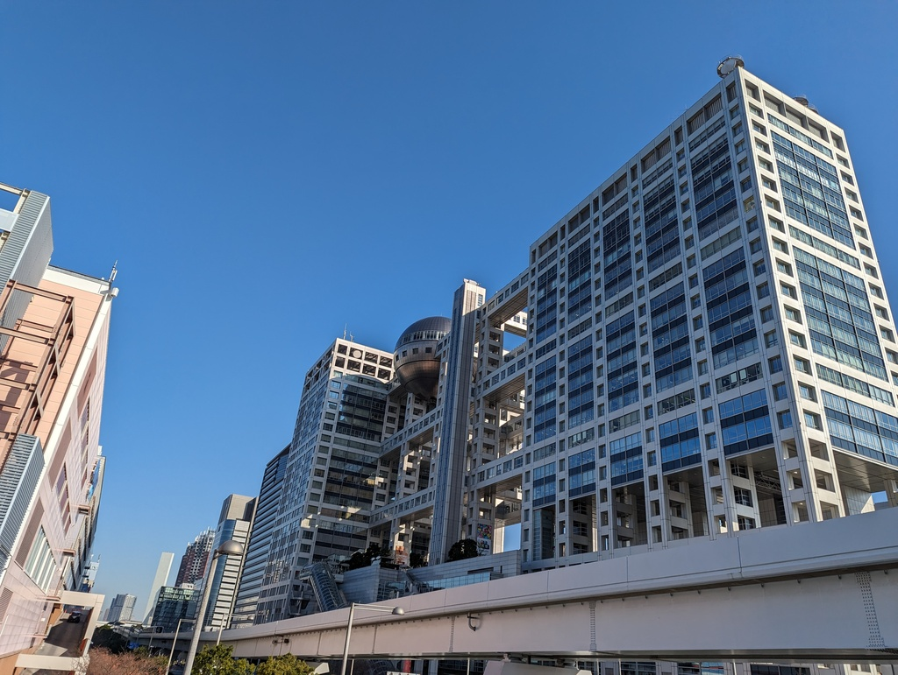<figcaption></figcaption></figure>

<figure>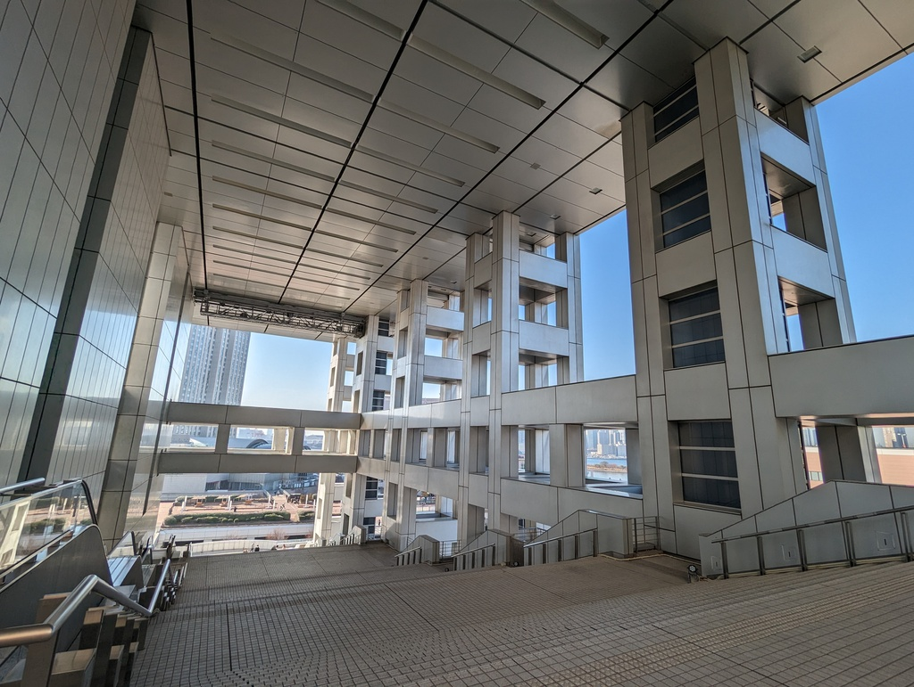<figcaption></figcaption></figure>

The train there (the [Yurikamome](https://en.wikipedia.org/wiki/Yurikamome)) is one of the most scenic transit rides I've taken.

<figure>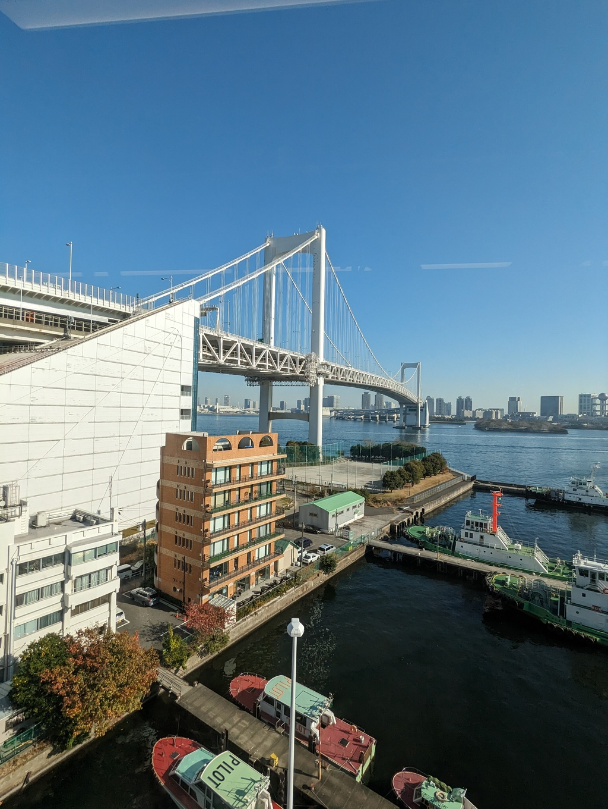<figcaption>Something about this building against the bridge...</figcaption></figure>

<figure><video controls width="800"><source src="tokyo/odaiba/bus_sync.mp4" /></video><figcaption>And on the way back, I wound up on a bus with an even cooler view... of the Yurikamome ascending the spiral!</figcaption></figure>

<figure>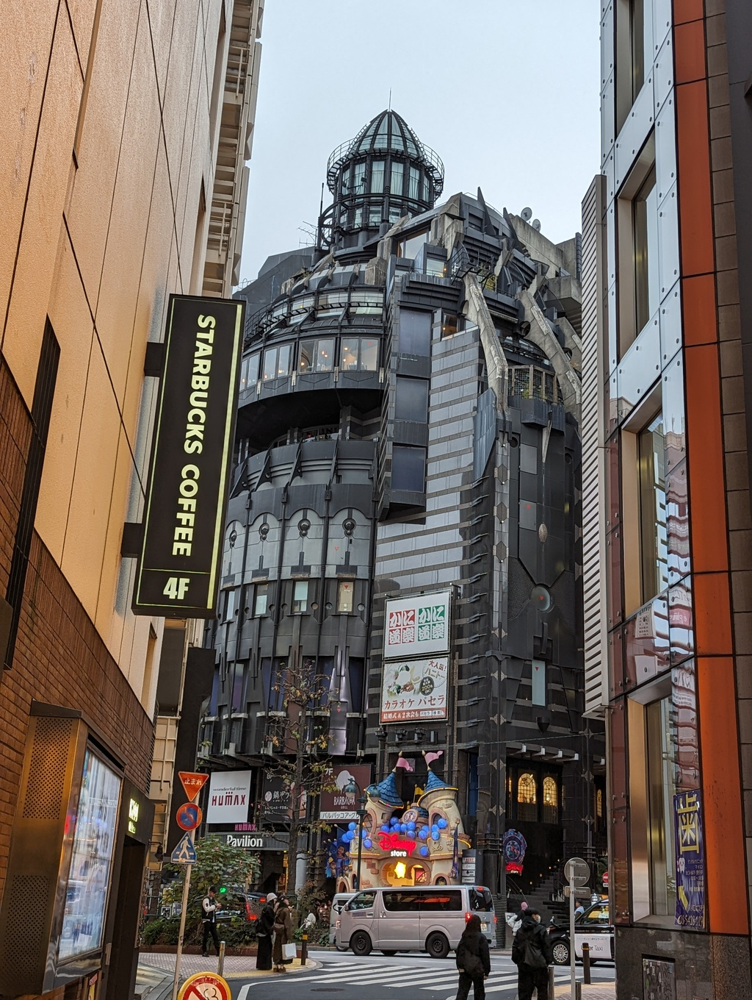<figcaption>And for reference, my second favorite building is also in Tokyo -- I think a Disney store? Although maybe the Kimpton Fitzroy in London has toppled that rank</figcaption></figure>

## Parkour

Since I was staying near Asakusa this trip, on my first night (both ears still blocked), I made a pilgrimage to the spot where in 2019, I managed my first ever [muscle-up on a bar](https://youtu.be/U6v06BqlOJU?t=112).

<figure><video controls width="800"><source src="tokyo/parkour/muscle_up.mp4" /></video><figcaption></figcaption></figure>

And on the way back from Odaiba, it made sense to return to Shinigawa, easily my [favorite parkour spot](https://youtu.be/U6v06BqlOJU?t=302) from 2019 -- and one that I discovered by completely aimless wandering. At this point, I'm only about two weeks from the reinjury and a few days off the crutch, so I didn't set any expectations, just let my body move around the space how it wanted. I didn't do anything big, but still immensely enjoyed playing around for a bit.

<figure>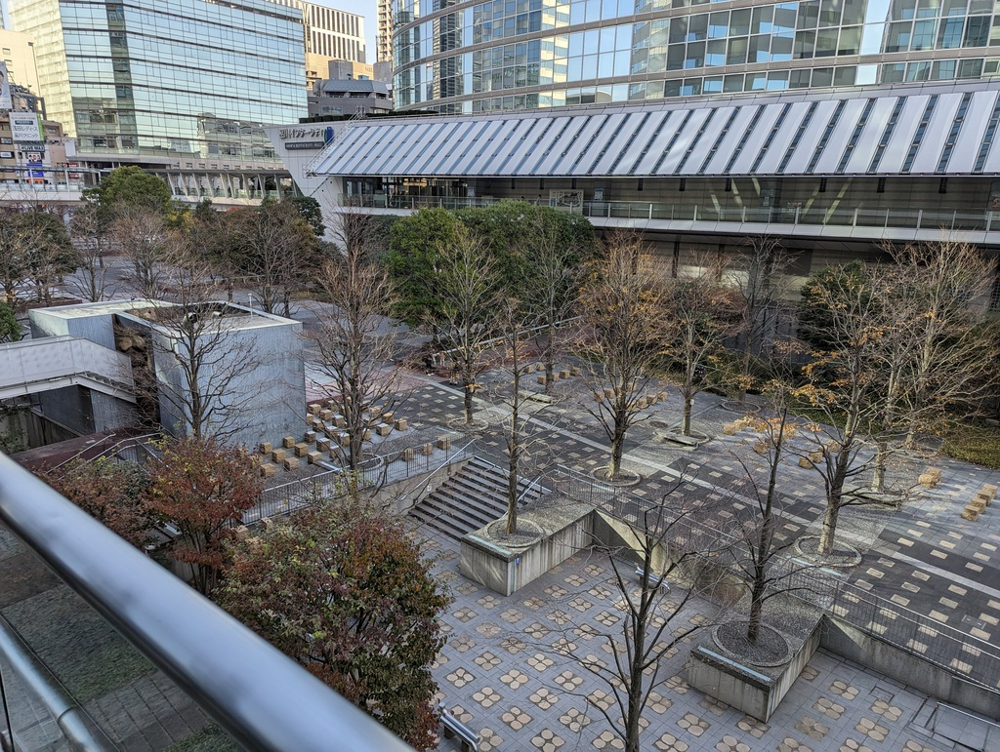<figcaption></figcaption></figure>

<figure><video controls width="800"><source src="tokyo/parkour/line.mp4" /></video><figcaption>It looks small here, but I really loved the feeling of accelerating into a big dive roll, and finding a fluid transition after the lazy vault that let me avoid my left leg</figcaption></figure>

## Art

I'm a bit of a mask collector, and I've had my eye on [Kamenya Omote](https://kamenyaomote.com/) for years. They have such a lovely shop, and although one piece really caught my eye, it was sliiightly out of my price range.

<figure>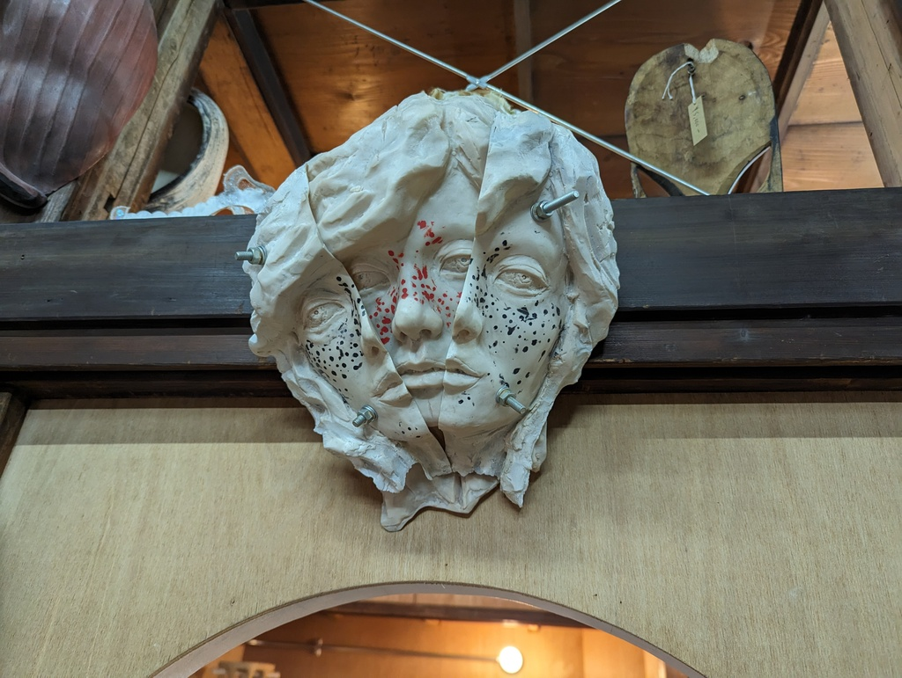<figcaption></figcaption></figure>

One night I spent a few hours slowly exploring a Junkudo bookstore in Ikebukuro. Even though I can't really read anything there, it reminds me of my high school days, where a bookstore was one of the only third spaces around. And I found plenty in there:

<figure>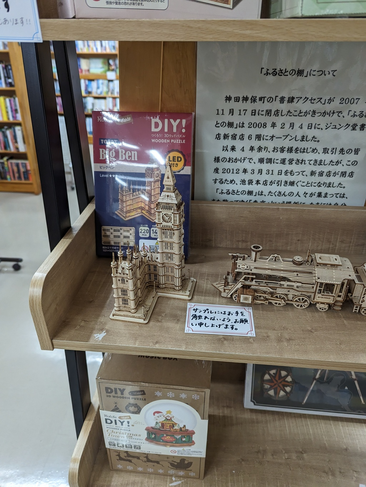<figcaption></figcaption></figure>

<figure>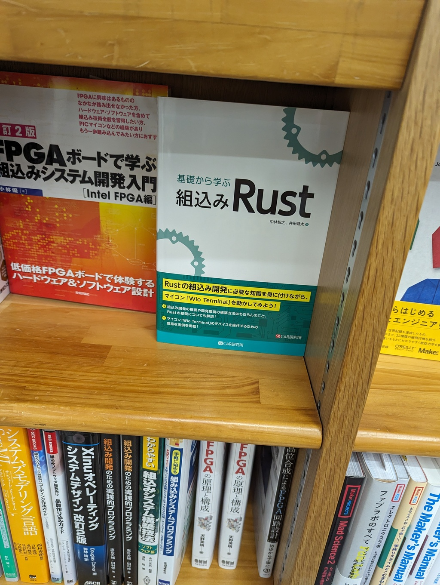<figcaption>I could read the code inside, minus comments! It was interesting to see what bits of tech are popular enough here to have books</figcaption></figure>

<figure>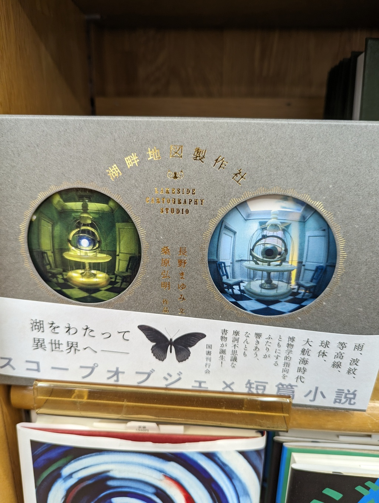<figcaption>I don't remember what this was, but the art style reminds me strongly of Lemony Snicket's ASOUE</figcaption></figure>

## OSM meetup and more severances

Most parts of Tokyo are so much more pedestrian friendly than Hong Kong, but I still found some baffling severances.

<figure>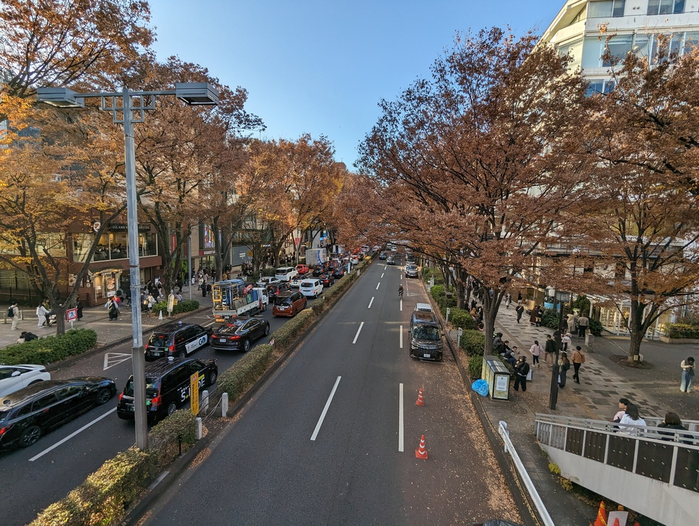<figcaption>The famous cat street in Harujuku is split by a big road, and the nearest crossing is a bridge</figcaption></figure>

<figure>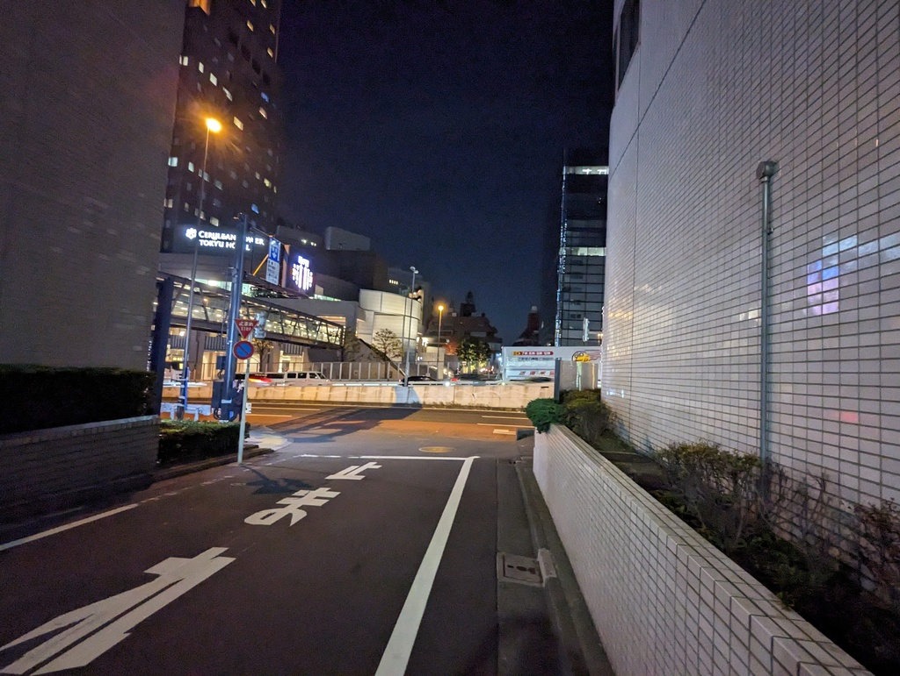<figcaption>On both sides of this massive highway near Shibuya, there's lovely quiet streets, but you do have to find a bridge</figcaption></figure>

Back in November, I had reached out to an OpenStreetMap Japan organizer, and they kindly organized a meetup while I was in town. I had a great time hanging out with them and learning about some of the GIS and digital twin datasets that're public in Japan. I also demoed my work with A/B Street and ATIP and showed off a new experiment that I started in Hong Kong to analyze all of these pedestrian unfriendly severances and how far you have to detour to cross the street. More on that Thursday, when I talk about some new experiments I started in December, but the curious can [open Christmas presents early](https://docs.google.com/presentation/d/1LRM0dsm0ez-2nB6Rgc81OXvAh1tHxb9OX1fviycWrhM/edit?usp=sharing) if they like.

## Wandering around

Tokyo is one of my favorite cities to aimlessly wander. Every few minutes if I'm in the right state of mind, there's some delightful quiet, ephemeral moment in the streetscape.

<figure>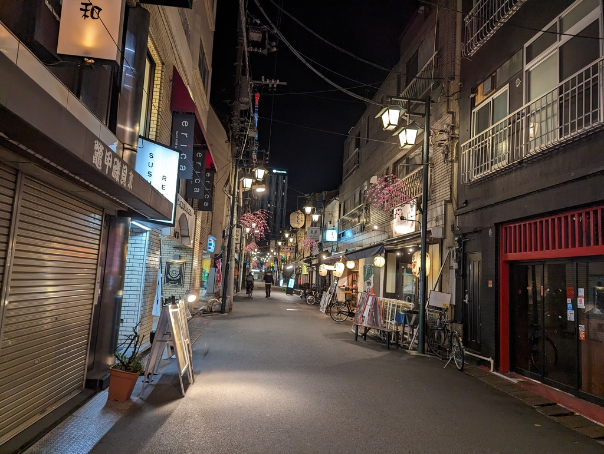<figcaption>Streets without any pavement are the best, because it's rare for there to be cars on these anyway. Someone walking alongside a slow cyclist instead is the vibe to expect.</figcaption></figure>

<figure>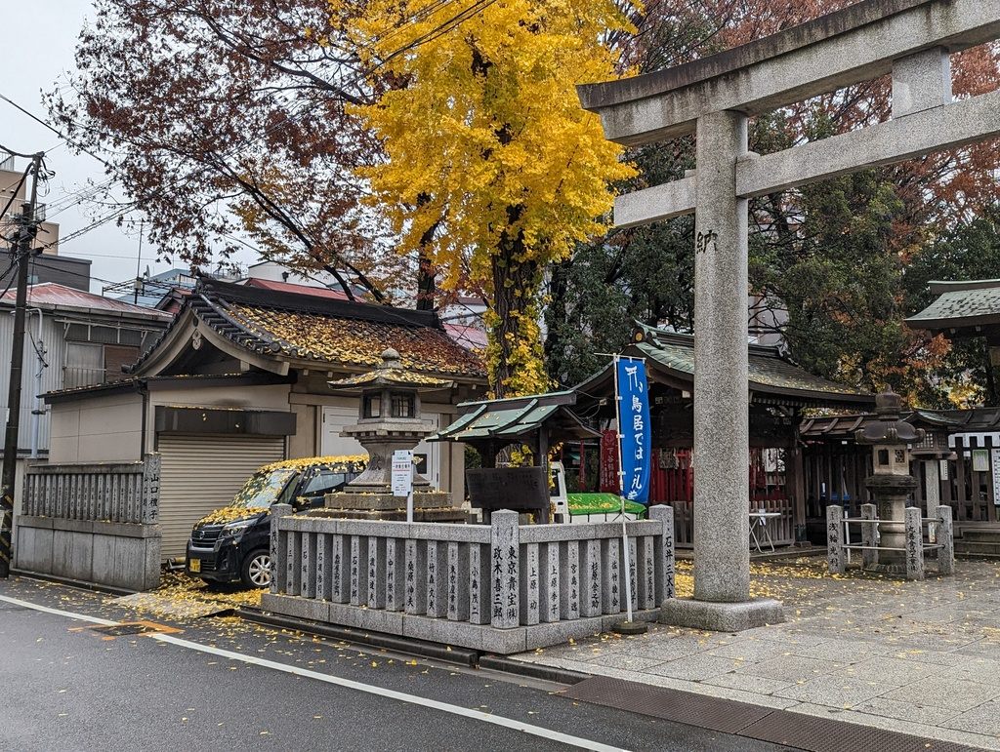<figcaption>Nature making some kind of statement</figcaption></figure>

<figure>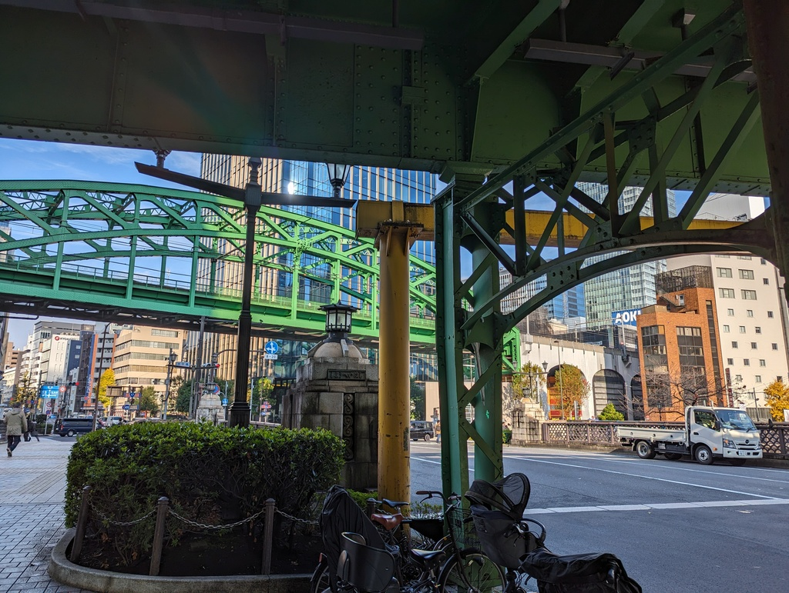<figcaption>Green is my favorite color for a reason</figcaption></figure>

<figure>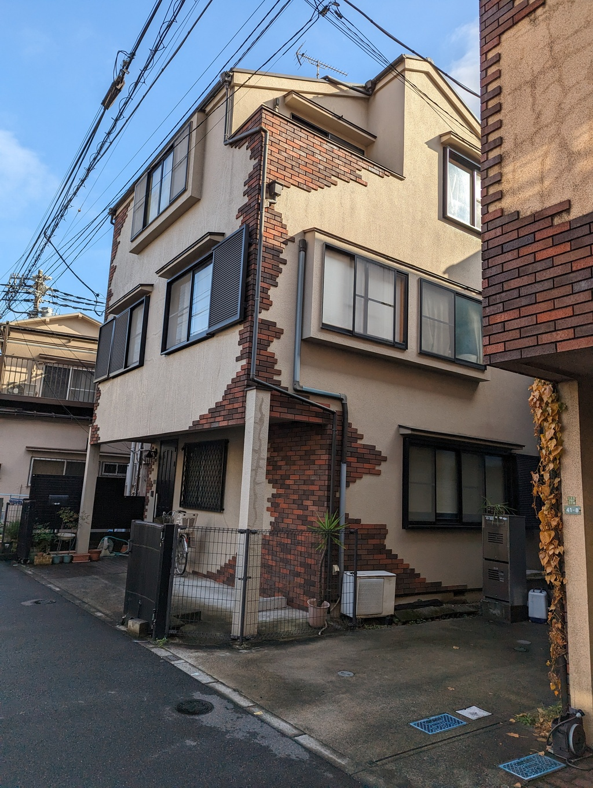<figcaption>In love with these brick patterns</figcaption></figure>

The land use patterns in Tokyo are lovely and perfect for aimless wandering. On my sunset walk towards Hanegi Park after some very filling takoyaki from a street stall, I spotted a food truck with Cuban sandwiches and gumbo (!!!) adjacent to a feminist bookstore, both in an otherwise residential alley.

<figure>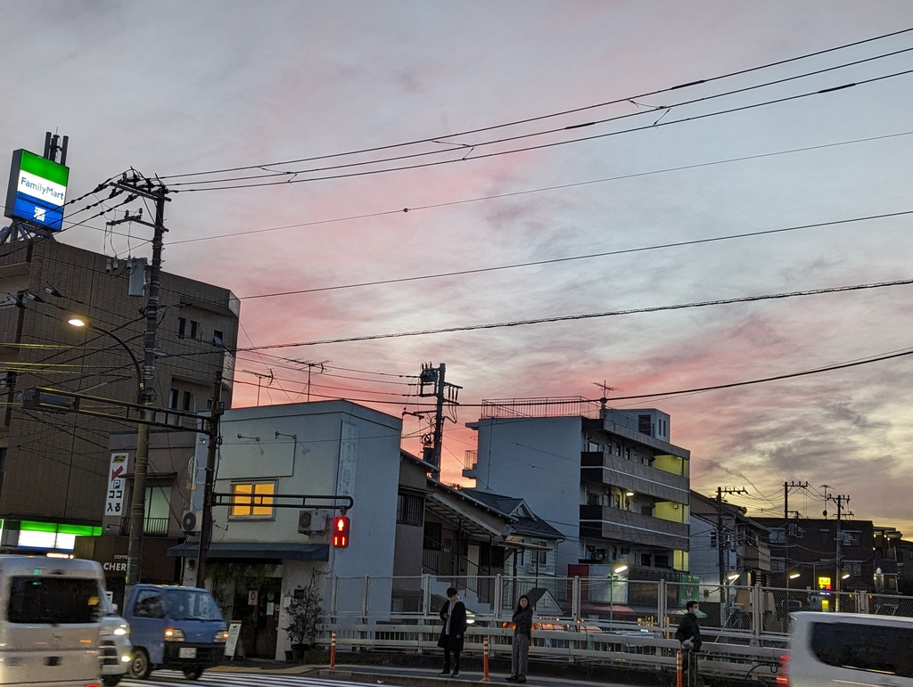<figcaption>Tragically beautiful sunsets</figcaption></figure>

<figure>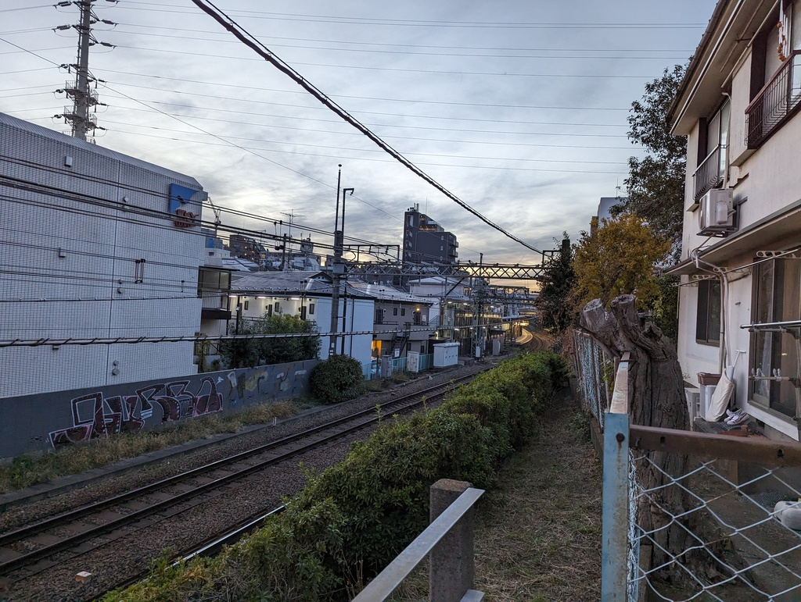<figcaption>A maze of twisty neighbourhood alleys dead-ended next to a train track. I felt so immensely peaceful walking around here.</figcaption></figure>

<figure><video controls width="800"><source src="tokyo/urbanism/boat.mp4" /></video><figcaption>Near Akihabara, a moment of interaction between a bird, a boat, and a train</figcaption></figure>

The metro felt infrequent compared to London, actually -- it felt like it took a while to cross Tokyo (which is HUGE). I think this was also true in 2019, but living in London has changed my standards. Someone later explained that the way to handle Tokyo transit is to trust in the timetables, because trains are so exactly on time, and just adjust when you get to the station.

<figure>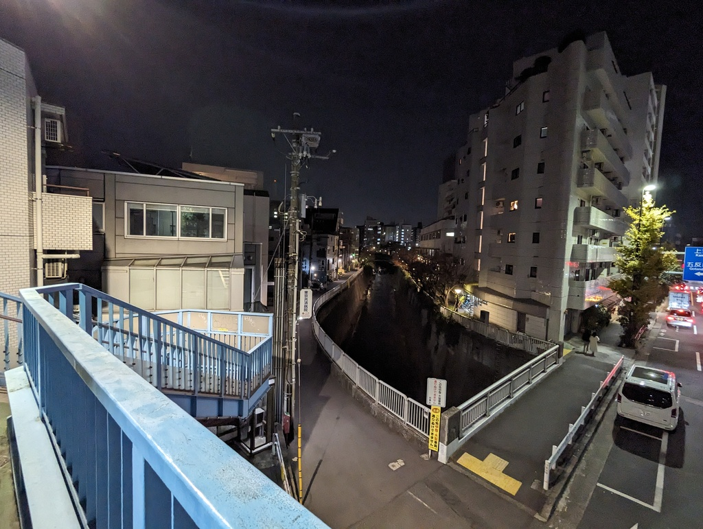<figcaption>Sometimes the overpass severances make up for it with a view, near Meguro</figcaption></figure>

<figure>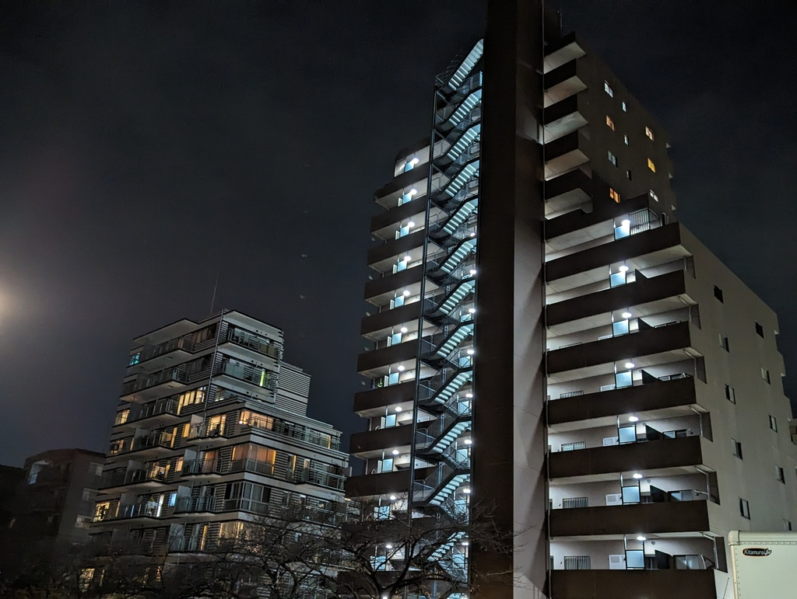<figcaption>I love the aesthetics of external staircases with certain lighting at night</figcaption></figure>

<figure><video controls width="800"><source src="tokyo/urbanism/river.mp4" /></video><figcaption>Looking back on this video, it's not that great, but in the moment, my mental state was so specific watching the white and red light mix.</figcaption></figure>

## Jazz kissa

At some point after 2019, I learned about [jazz kissaten](https://en.wikipedia.org/wiki/Jazz_kissa) and also started getting into jazz more, so I was very thrilled to return to Tokyo and experience these.

Of the 5 or 6 I visited (including in Kyoto), the two that stood out the most were Meikyoku Kissa Lion, which played booming orchestral music in a somewhat eerie Victorian room, and Donato, where I consumed delicious honey toast and where I got introduced to [Johnny Dyani](https://www.youtube.com/watch?v=u2496HG2CZY), who's quickly becoming one of my favorites.

<figure>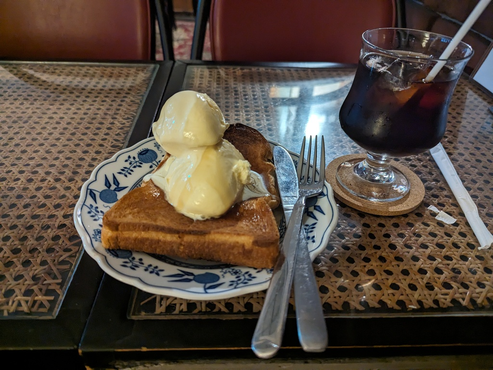<figcaption></figcaption></figure>

Most of the jazz kissa are about silently enjoying the music and meditatively sipping coffee. But one of my last nights in Tokyo I was in a chattier one. Two older folks there commemorating the passing of a friend struck up a conversation with me, easily the most enjoyable hour of talking to a stranger I've had in years.

With a few exceptions, most of the jazz kissa I went were frequented by much older people. I feel odd discovering jazz kissa only now, like I really feel the nostalgia of something lost that these cafes are trying to keep alive. The era the cafes are nostalgic for isn't one I experienced, though. This is certainly not the first time in my life I've felt like I was "born in the wrong era" -- I spent high school obsessed with roguelikes, <http://textfiles.com>, BBSes, all sliiightly before my time.

## Food

Of course I'm already sorely missing the food from Japan (and figuring out what I can reasonably make myself).

<figure>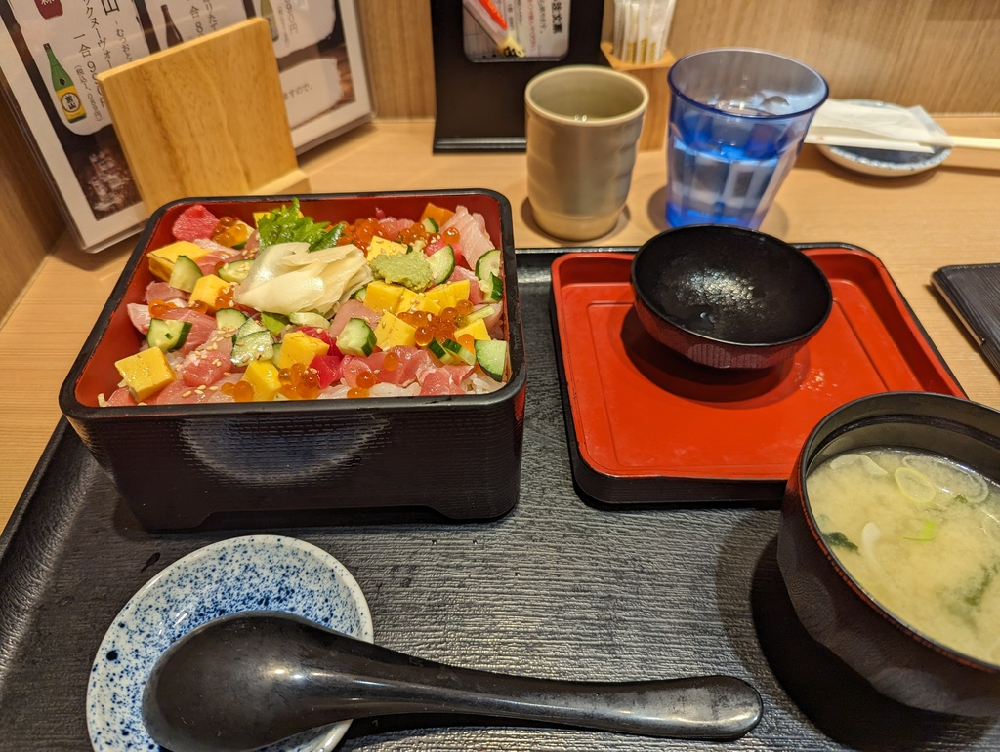<figcaption>So filling and healthy-feeling</figcaption></figure>

<figure>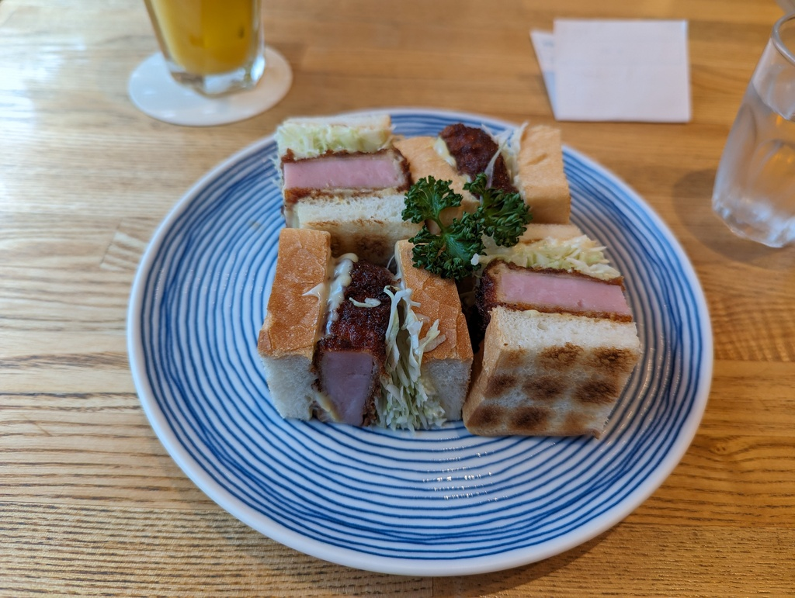<figcaption>I was staying near some Instagrammy spot with very aesthetically deconstructed sandwiches, and managed to slip in without queueing one day</figcaption></figure>

<figure>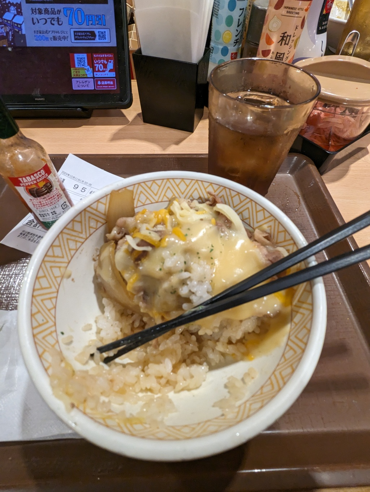<figcaption>I really wish there was some equivalent of Sukiya where I live. Gyudon makes excellent late-night fast food. Cheaper, tastier, and probably healthier than fast food in London or the US... Luckily easy to make at home.</figcaption></figure>

## What's next

The first two weeks of my trip were just sort of me being a tourist or experiencing things, and so these first two posts have been a bit plain. But check back tomorrow for my second week in Japan, where things start to move a bit more.
