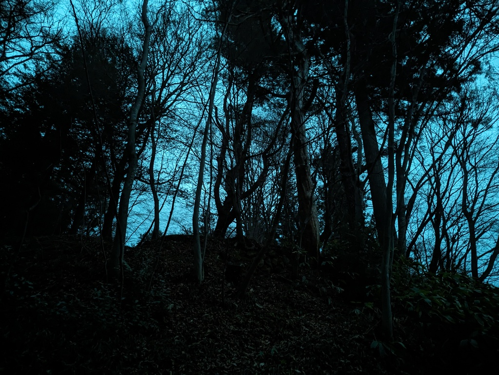

# December 2023 trip, part 3: Takayama

4 January, 2024

All photos are [CC BY-NC-SA](https://creativecommons.org/licenses/by-nc-sa/4.0/). I compressed a bunch; [email me](mailto:dabreegster@gmail.com) if you want originals.

- Part 1: [Hong Kong](pt1_hk.md)
- Part 2: [Tokyo](pt2_tokyo.md)
- Part 3: Takayama
- Part 4: [Karuizawa](pt4_karuizawa.md)
- Part 5: [Kyoto and Narita](pt5_kyoto.md)
- Part 6: [Seoul](pt6_seoul.md)

## Introduction: Takayama (2 days)

Overall, Takayama was nice to poke around, but I wouldn't make a point of going back.

I stayed in a quasi-ryokan here -- nice tatami room (more than 4.5 of them, so [no risk of slipping into parallel universes](https://en.wikipedia.org/wiki/The_Tatami_Galaxy)) and a shared bath to finally soak my sad sore muscles.

## The town

Takayama is supposed to have this historic town center, but... meh. It's mostly a rat run for cars, except for one or two really touristy streets. Outside the tiny core, it becomes kind of suburban / industrial pretty quickly.

<figure><figcaption>Look, I found slip lanes!</figcaption></figure>

<figure><figcaption>Particularly nice croissant with anko (red bean paste)</figcaption></figure>

<figure><figcaption>Nice calm skyline</figcaption></figure>

<figure><figcaption>This was on a rainy morning, but guess this spot fills up</figcaption></figure>

<figure><figcaption>Tabino Shiori cafe would be worth returning to</figcaption></figure>

## A hike, but mostly a bus ride

I took a bus into the mountains, to the base of Shinhotaka ropeway. It was around 44 USD round-trip and took a few hours... and wasn't really worth it. I was looking for a proper mountain hike, but the trail I took was more of a forest service road for the first few hours. It got _really_ nice and kind of snowy-jungle steep, but I couldn't spend too long enjoying this hard-earned spot, because the last bus back to Takayama was a bit before sunset. The trails here must be easier to explore in summer or if you home-base at a ryokan in the mountains themselves.

<figure><figcaption>Mostly this</figcaption></figure>

<figure><figcaption>I'm not hard to track</figcaption></figure>

<figure><figcaption>As above, so below...</figcaption></figure>

<figure><video controls width="800"><source src="takayama/bus_hike/ascent.mp4" /></video><figcaption>The fun bit</figcaption></figure>

## The hill at dusk

After the long bus back at dusk, I wandered around an old part of town, winding up at some shrine not really on the map.

<figure><figcaption></figcaption></figure>

There were so many fallen leaves on the way up, I felt like I was swimming through them... 

<figure><figcaption></figcaption></figure>

<figure><figcaption></figcaption></figure>

<figure><video controls height="800"><source src="takayama/dusk_hill/crunch.mp4" /></video></figure>

Then suddenly I was at the top, and I didn't have anywhere to be. Some music started in the distance.

<figure><video controls height="800"><source src="takayama/dusk_hill/music.mp4" /></video></figure>

Some time later, I started going down...

<figure><figcaption></figcaption></figure>

I spotted this lamp post somewhere at the bottom of the hill, on some small empty road also not on a map...

<figure><figcaption></figcaption></figure>

And suddenly I felt something that I've been trying to put into words for a few weeks. It was kind of like a feeling of peace, or proper stillness. And in that stillness, for the first time in a very long time, I could feel everything moving around inside of me. It wasn't like a revelation of something I didn't know; more like something old that I've forgotten, or lost sight of -- repeated to myself rationally but felt unfamiliar, didn't really believe.

<figure><figcaption>I spend most of my time hyper-focused on one thing or another, or probably both at once...</figcaption></figure>

<figure><figcaption>But suddenly, I felt able to calm down and let go of everything</figcaption></figure>

It's a little ridiculous I need to go to the other side of the world to "unblock" this inner thing, but... I kind of already knew this; it's not the first time. It's a simple formula. A few weeks in loud, unfamiliar cities, with almost no human contact. Let the language part of the brain rot, let that rot ferment into something, then suddenly cutover to a very quiet, empty, natural area.

After this, I returned to reality, had a fantastic sweet potato amber beer and a mediocre burger somewhere, and wandered west with a certain lightness. I hit a mandatory pedestrian underpass that had a sign "it's unsafe to cross here", and I may have muttered "well you designed it that way" in my head or possibly aloud...

<figure><figcaption>Priorities from the traffic engineers are clear</figcaption></figure>

(To be fair, I was probably salty from all the underpasses in Hong Kong. It was an immaculately well-lit, clean underpass with a bag of salt to toss on any ice that formed.)

On the other side, starting up a steep hill, someone maybe twice my age started following me, or rather, walking the same way -- just up an increasingly empty, dark hill. I dunno if they heard me earlier or not. I just walked quickly and lost them eventually. I wonder what they thought of the foreigner with a knee brace and unnecessarily bright backpack marching up a steep hill into darkness.

But steep hills into darkness are a specialty, so...

## What's next

I already slipped on posting yesterday, so I'm not going to try and be ambitious about finishing too much today. Next up, Karuizawa.
