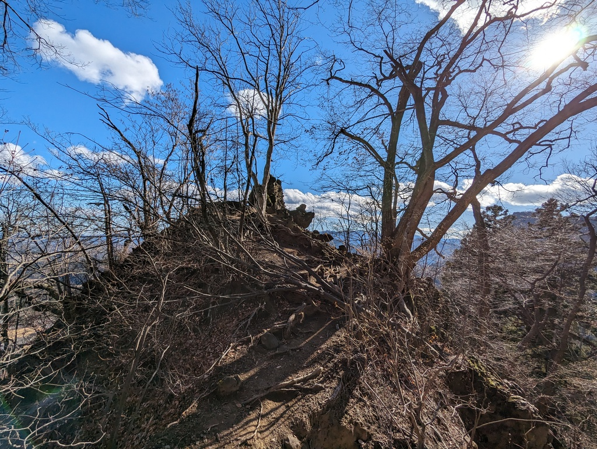
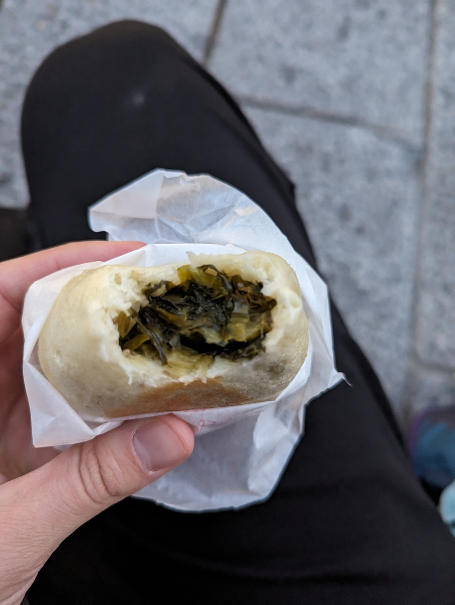

# December 2023 trip, part 4: Karuizawa

6 January, 2024

All photos are [CC BY-NC-SA](https://creativecommons.org/licenses/by-nc-sa/4.0/). I compressed a bunch; [email me](mailto:dabreegster@gmail.com) if you want originals.

- Part 1: [Hong Kong](pt1_hk.md)
- Part 2: [Tokyo](pt2_tokyo.md)
- Part 3: [Takayama](pt3_takayama.md)
- Part 4: Karuizawa
- Part 5: [Kyoto and Narita](pt5_kyoto.md)
- Part 6: [Seoul](pt6_seoul.md)
- Part 7: [Reflections](pt7_reflections.md)
- Part 8: [Technical projects](pt8_tech.md)

## Introduction: Karuizawa (3 days)

Karuizawa felt kind of dead, but that was more than alright -- it was somehow suited to that. The main shopping street might've had nice things, but everything opened late and closed early, so was incompatible with my two days of spending daylight hours hiking. Instead I ate dinner at the big mall south of the station.

<figure><figcaption>The most epic ramen I've had in years, at this mall -- shio tsukune. I'd be happy swearing off of tonkatsu forever for this salty explosion of umami</figcaption></figure>

<figure><figcaption>The breakfast burrito of Japan -- some fried shrimp, salted plum, fishcake, and more, all wrapped in a tofu pocket</figcaption></figure>

<figure><figcaption>Traffic was quiet every time I passed, but I thought it was hilarious to find crossing flags</figcaption></figure>

## The sunset

Karuizawa set its tone immediately. After arriving and dumping my bags, I started walking vaguely in search of a trail to Usui Pass that I spotted on both OSM and Google Maps. But 10 minutes into the walk, I get to a path OSM claims exists between streets, but it was just a steep hill full of leaves. Alright... I bushwhacked up, into what kind of felt like a gated-community-without-a-gate of elaborate treehouses and fancy mountain cabins. I kept going towards some supposed trails, but they didn't exist -- just twisty and steep streets with not a soul in sight.

<figure><figcaption>Dead quiet</figcaption></figure>

<figure><figcaption>Cozy</figcaption></figure>

<figure><video controls width="800"><source src="karuizawa/sunset/uphill.mp4" /></video><figcaption>highway=path, suuure</figcaption></figure>

But I'm so thankful for the imperfect information I was operating on, because I might not've gone that way otherwise. I wound up in the right place at the right time.

<figure><figcaption>Phone camera doesn't do it justice. This sunset burned a hole through my heart.</figcaption></figure>

And then on the dark walk back, a few moments:

<figure><figcaption>"Blur and focus" could be a London cafe name</figcaption></figure>

<figure><figcaption>I feel like I could appreciate both states at this point</figcaption></figure>

## The Nakasendo

My first main day, I set out to hike a chunk of the old Nakasendo trail that connects Tokyo and Kyoto. Armed with curry pan and a rhubarb croissant from one of the only places open as painfully early as 10am, I set out.

<figure><figcaption></figcaption></figure>

<figure><figcaption></figcaption></figure>

<figure><video controls width="800"><source src="karuizawa/nakasendo/valley.mp4" /></video><figcaption>I was trying to find a spot where two trees on opposite valley banks would touch</figcaption></figure>

<figure><figcaption>The border between Nagano and Gunma prefecture</figcaption></figure>

After reaching Usui Pass, the real fun began. I haven't been in such a beautiful place in so long. There were sections where the accumulated leaves were so deep, I had to shuffle forwards to feel the contours in the ground. There are just so many pictures; I was awash in a paradise of leaves, hills, and ridges.

<figure><figcaption></figcaption></figure>

<figure><video controls width="800"><source src="karuizawa/nakasendo/pan.mp4" /></video><figcaption></figcaption></figure>

<figure><figcaption></figcaption></figure>

<figure><figcaption></figcaption></figure>

<figure><figcaption></figcaption></figure>

<figure><figcaption></figcaption></figure>

<figure><figcaption></figcaption></figure>

<figure><figcaption></figcaption></figure>

<figure><figcaption></figcaption></figure>

<figure><figcaption></figcaption></figure>

<figure><figcaption></figcaption></figure>

I only saw a handful of people the whole day. There was a pair of mountain bikers (!!) at the end; it looked ridiculously fun.

<figure><figcaption></figcaption></figure>

After emerging from the trail, I walked alongside the railroad for a bit and stopped for a few hours in an outdoor onsen. They also served food, but I made the mistake of catching a train back before dark -- next time I would definitely stay longer.

## Myogi

The next day, I headed to Mt Myogi. It was about an hour walk from the station through a totally dead rural town and semi-highwayish mountain roads.

<figure><figcaption></figcaption></figure>

<figure><figcaption></figcaption></figure>

<figure><figcaption>I had plenty of time to think about what I was going to climb</figcaption></figure>

Right as I got to the shrine, someone fell off their motorcycle on the steep road. I helped them pick it up; they were fine. After trying to decipher some of the trail closure maps, I started ascending. I love trails like this that don't waste time with switchbakcs -- just straight up.

<figure><figcaption></figcaption></figure>

<figure><figcaption>It was my first time using chains. It made everything so easy, but I still really enjoyed the 大 rock. There was a tricky bit transferring between two chains on the way down.</figcaption></figure>

<figure><figcaption></figcaption></figure>

Downhill was steep and leafy. I was a bit worried about my knee, but because it was so steep, I felt perfectly justified scrambling down with all-fours, and it was quite fun and totally fine.

<figure><video controls width="800"><source src="karuizawa/myogi/down.mp4" /></video><figcaption></figcaption></figure>

<figure><figcaption></figcaption></figure>

I had so much fun there, but a bunch of the trails were closed, so I don't think I even got to consider the advanced routes to the top. I'd 100% go back.

I decided to spend the rest of the day in Nagano to take advantage of my JR pass flexibility. There was some downtime before the train, so I had a lunch of warm canned corn soup and sweet potato milk from a vending machine. I must've been an odd sight taking a break in that quiet little town, because somebody chuckled at me going up the stairs nearby.

<figure><figcaption></figcaption></figure>

## Nagano

It was weird to suddenly be back in a bigger place, even though I had only been in quieter spots for 4 days. I was only in Nagano a few hours, and not much stood out.

<figure><figcaption></figcaption></figure>

<figure><figcaption>Spinach oyaki</figcaption></figure>

<figure><figcaption></figcaption></figure>

<figure><figcaption></figcaption></figure>

<figure><figcaption></figcaption></figure>

## What's next

I'll try to finish up Japan tomorrow and move onto Seoul...
