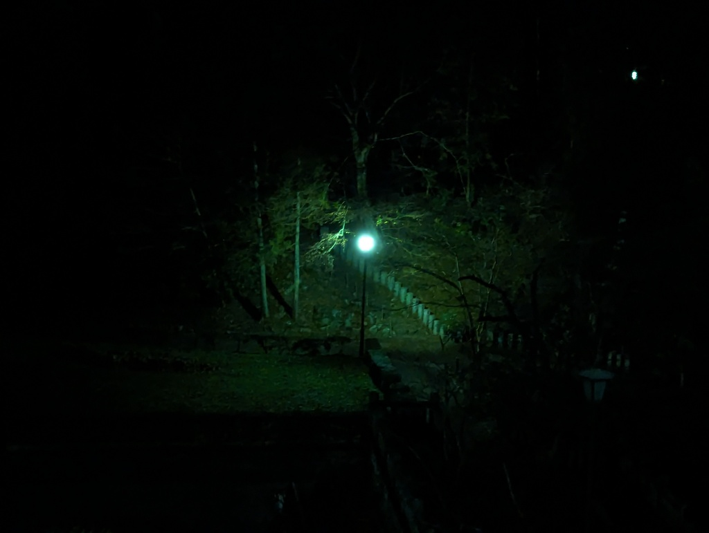

# December 2023 trip, part 5: Kyoto and Narita

7 January, 2024

All photos are [CC BY-NC-SA](https://creativecommons.org/licenses/by-nc-sa/4.0/). I compressed a bunch; [email me](mailto:dabreegster@gmail.com) if you want originals.

- Part 1: [Hong Kong](pt1_hk.md)
- Part 2: [Tokyo](pt2_tokyo.md)
- Part 3: [Takayama](pt3_takayama.md)
- Part 4: [Karuizawa](pt4_karuizawa.md)
- Part 5: Kyoto and Narita

## Introduction: Kyoto (2 days)

Like Tokyo, I think I enjoyed this visit to Kyoto more than 2019.

### Being a tourist

<figure><figcaption>I had low expectations for the Nintendo store, but they were playing the Mario Sunshine OST, and they had a Metal Mario plushie -- not just generic swag from the most popular or recent games</figcaption></figure>

<figure><figcaption>And unexpectedly, a Cotopaxi store! Mine's doing just fine, though</figcaption></figure>

### Cars

I have to check my notes from 2019, but the famous [Kiyamachi Street](https://en.wikipedia.org/wiki/Kiyamachi_Street) was... a rat-run for cars. If you walk along the water, you dodge southbound traffic.

<figure><figcaption>The hedges were high here and you can't see the water much anyway, but other sections could've been nicer.</figcaption></figure>

<figure><figcaption>Argh, back in the land of severances...</figcaption></figure>

<figure><figcaption>It <i>was</i> still quite beautiful</figcaption></figure>

<figure><figcaption>I also found my absolute favorite modal filter ever: tiny Torii gates</figcaption></figure>

### The ridge of leaves

After coffee and pancakes on the Philosopher's Path, I made my way up Mt Daimonji. After getting to the top, there was something translated as "spider valley" on the map that I was curious about, so I found a path sliding down a leafy hill and stumbled into the real charm of this area.

<figure><figcaption>Stopping to discuss the finer points of psychogeography with another philosopher</figcaption></figure>

<figure><figcaption>I'm usually more interested in the trail than the views, but I really appreciated how far across all of Kyoto you can see from the east</figcaption></figure>

My new route went along a ridge slippery with leaves. There were sections where once again I felt like I was swimming through them. I know this is not exactly where Miyamoto grew up and got inspiration for Zelda, but that didn't stop me from humming the Lost Woods theme or returning to a dusty old idea for a game (set in a sort of bijection space between a city and a forest). If I had a place like this so readily accessible, I would heal my knee injuries through conditioning by just natural movement. I _need_ a place like this for my sanity, or inner child, or something.

<figure><video controls height="800"><source src="kyoto/hike/ridge.mp4" /></video><figcaption>Sometimes I was on top of the world on a slippy ridge</figcaption></figure>

<figure><video controls width="800"><source src="kyoto/hike/slide.mp4" /></video><figcaption>And other times I was sliding down a valley of leaves</figcaption></figure>

<figure><video controls width="800"><source src="kyoto/hike/stream.mp4" /></video><figcaption>There felt like endless variations of places to explore</figcaption></figure>

### The river

Without really trying to, I found two of my old parkour spots from 2019. There must be inherent network structure or a pattern to my wandering. It was bittersweet to find these and remember how much fun I had last time. But now I have the ridge of leaves, and anyway, I'll find a way to return to jumping/striding someday.

<figure><figcaption><a href="https://www.youtube.com/watch?v=U6v06BqlOJU&t=204s">A naturally playful spot</a></figcaption></figure>

<figure><figcaption>I <a href="https://www.youtube.com/watch?v=U6v06BqlOJU&t=227s">nearly crossed paths</a> with somebody here, years ago</figcaption></figure>

The place where the Kamo River and Takano River meets has some significance in the [Night is Short, Walk on Girl](https://en.wikipedia.org/wiki/Night_Is_Short,_Walk_On_Girl) and/or [Tatami Galaxy](https://en.wikipedia.org/wiki/The_Tatami_Galaxy), and I can see why. Slowly walking here at dusk, I experienced my second moment of deep inner stillness.

<figure><figcaption>Two trees who've both wound up in the right place</figcaption></figure>

<figure><figcaption>A choice to linger at</figcaption></figure>

<figure><figcaption></figcaption></figure>

<figure><figcaption>But eventually, it was time to move on</figcaption></figure>

<figure><video controls height="800"><source src="kyoto/river/crows.mp4" /></video><figcaption>A murder at dusk</figcaption></figure>

<figure><figcaption>Decadently rich omurice to end</figcaption></figure>

### Fushimi Inari

I paid another visit to this famous shrine. I didn't really get much out of it in 2019, but this time I did. It's a delightful experience of light vs shadow and reptition vs variation. The narrow spaces have a very solemn tone.

<figure><figcaption></figcaption></figure>

<figure><figcaption></figcaption></figure>

<figure><figcaption></figcaption></figure>

Someone asked me how long an optional loop took, and expressed concern that they heard the lights would go off at 8. I thought that was funny -- there's no way they would strand a bunch of tourists in the dark, right? Nearly at the bottom, I stopped to wait with somebody who had rolled their ankle going down the dark steps. I was able to offer tape, but they denied further help. I really hope the rest of their night and trip was alright. Visiting a new place without being able to walk comfortably can be a bit miserable.

## Narita (a day)

I had about a half-day in Narita before an early flight to Seoul. I thought it'd just be a transition day and didn't expect to write about it, but actually... I went for an evening walk along the main shopping street, but there were was too much traffic passing quickly on the narrow street, so I wandered off to a temple and pagoda and found more peaceful nocturnal moments of delight.

<figure><figcaption></figcaption></figure>

<figure><figcaption></figcaption></figure>

<figure><video controls height="800"><source src="narita/bamboo.mp4" /></video><figcaption>Emerging back into the real world, a passage lined with bamboo</figcaption></figure>

It was kind of surreal to emerge from that and find myself in some parody of American suburbia, complete with a stroad and excessive parking.

<figure><figcaption></figcaption></figure>

<figure><figcaption></figcaption></figure>

<figure><figcaption></figcaption></figure>

<figure><figcaption>The idea of a gym named for reacting to consumption of snacks is hilarious</figcaption></figure>

I waded through the parking lot into a mall with the hugest grocery store I've seen in Japan, at that perfect time of night when all the deli items get massively discounted.

<figure><figcaption>A geometric parking lot</figcaption></figure>

<figure><figcaption>My hotel room had very old-school electronics</figcaption></figure>

## What's next

Onto Seoul, my last stop!
