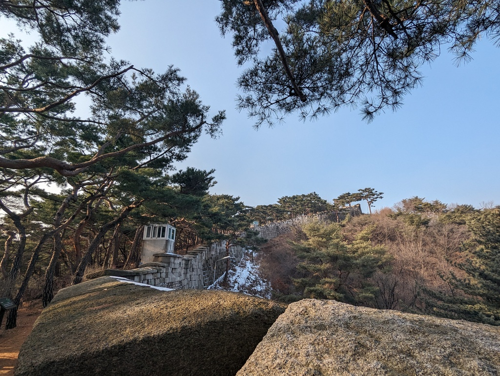
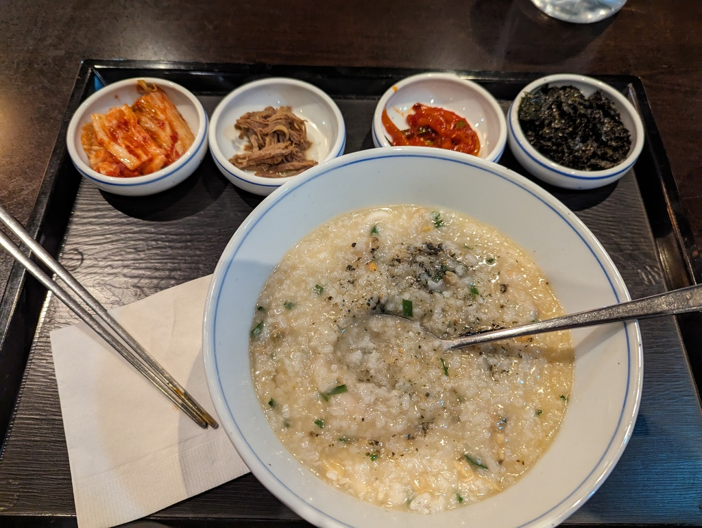

# December 2023 trip, part 6: Seoul

7 January, 2024

All photos are [CC BY-NC-SA](https://creativecommons.org/licenses/by-nc-sa/4.0/). I compressed a bunch; [email me](mailto:dabreegster@gmail.com) if you want originals.

- Part 1: [Hong Kong](pt1_hk.md)
- Part 2: [Tokyo](pt2_tokyo.md)
- Part 3: [Takayama](pt3_takayama.md)
- Part 4: [Karuizawa](pt4_karuizawa.md)
- Part 5: [Kyoto and Narita](pt5_kyoto.md)
- Part 6: Seoul

## Introduction: Seoul (9 days)

The low in Seoul was -15C (before wind chill!) for my first two days. I've never been in such a cold place before! I was comfortable clothing-wise, except for the face. After 15 minutes outside, I almost couldn't move my mouth and speak. Masks helped, though. The weather made the first few days of aimless wandering less spontaneous, more strategic, but the rest of the week was fine. Oh, and many of the bus stop seats are **heated** -- this blew my mind.

<figure><figcaption>Encumbered</figcaption></figure>

## Wandering

My usual aimless wandering strategy worked poorly in Seoul. The sheer size of the city is staggering, and it felt easy to miss the broad appeal of an area if you're a block or two away from the main street. I first wound up in Hongdae at 10am on a weekday and didn't enjoy it at all, but returning at night and following the main path was more rewarding. I still don't understand what's supposed to be interesting about Gangnam; there were just lots of big roads, slow traffic signals, and loud traffic. Insa-dong, Ikseon, and Hongdae (at the right times) were exceptions -- you don't need a plan to roam there. My favorite area was a small neighborhood near Seoul National University, with steep streets, winding alleys, and all of the architecture that's usually a consequence of those things.

Here's a massive photo dump of things that caught my attention:

<figure><figcaption>The snow enjoyed taking a rest</figcaption></figure>

<figure><figcaption>Some slightly liminal spaces in the snow</figcaption></figure>

<figure><figcaption>A parkour spot I found but didn't experiment with yet</figcaption></figure>

<figure><figcaption>Haven't seen a roundabout in a while!</figcaption></figure>

<figure><figcaption>In a museum, the rise in car use was portrayed positively as an economic boom</figcaption></figure>

<figure><figcaption>A robot made of many parts</figcaption></figure>

<figure><figcaption>Keep attacking that windmill, Don</figcaption></figure>

<figure><figcaption>A vending machine for fortunes, depending on your personality</figcaption></figure>

<figure><figcaption>Please do not train your shin-kicking here</figcaption></figure>

<figure><figcaption>Some of the nice buildings on a slope</figcaption></figure>

<figure><figcaption>Nice moments at night</figcaption></figure>

<figure><figcaption>Almost felt like I was back in HK for a moment</figcaption></figure>

<figure><figcaption>I saw so many vending machines through this whole trip, but this one made me chuckle the most</figcaption></figure>

<figure><figcaption>A university campus is always the place to explore for both art</figcaption></figure>

<figure><figcaption>and parkour spots</figcaption></figure>

<figure><figcaption>Things that may or may not be inside</figcaption></figure>

<figure><figcaption>Another Taiwan-ish building spotted</figcaption></figure>

<figure><figcaption>Cheonggyecheon stream is sandwiched by big roads, but nice to walk along, especially during the lantern show</figcaption></figure>

<figure><figcaption>Two buildings almost facing</figcaption></figure>

<figure><figcaption>Two very different portals</figcaption></figure>

<figure><figcaption>A scenic view of a severance</figcaption></figure>

<figure><figcaption>I bet this place in Ikseon looks so cool at night</figcaption></figure>

## Movement and meeting people

Walking up to Seoul Tower, I found the secret outdoor old-guy gym. People twice my age were doing feats of calisthenics I'm jealous of in below-zero. I played around on a bar for a bit, but my hands didn't last long on that metal bar.

After a slightly awkward dinner alone in a clearly-for-groups place (the portion sizes were definitely not for one person, and someone even asked why I was drinking alone...), I decided to break my silence and seek some company. I found some people online and joined a small group at a bouldering gym in Sillim. The problems there were more technical and less strengthy than my usual London gyms, and I enjoyed climbing again. We had a long meal after, and I learned about what it's like to live in Korea right now, and about how the US used to be admired as a place to dream of going, but how much that's changed.

Later in the week, I also later met up with one of the main parkour practitioners in Seoul and had a great day working on low-line flowy movements, co-designing balance and reaction-time games, and demonstrating to myself that my parkour career isn't done.

## Christmas

I started Christmas Eve by hiking Bukhansan Peak, one of those catastrophically beautiful snowscapes. The ranger station kindly lends out free microspikes, which definitely made the last icy stretch less sketchy. There were chains for the really slippery bits, mounted on vertical poles. I enjoyed finding a few ways to use just the poles going both up and down.

<figure><video controls width="800"><source src="seoul/bukhansan/no_swimming.mp4" /></video><figcaption>"No swimming" -- yeah that's some good advice</figcaption></figure>

<figure><video controls width="800"><source src="seoul/bukhansan/sunny.mp4" /></video><figcaption>Very sunny and nice going up</figcaption></figure>

<figure><figcaption>The terrain</figcaption></figure>

<figure><figcaption>The view</figcaption></figure>

<figure><video controls width="800"><source src="seoul/bukhansan/everything.mp4" /></video><figcaption>Ehem, that didn't do it justice -- the view of both other mountains and Seoul (and also some Santas... Santa Clauses? Santas Clause?)</figcaption></figure>

<figure><figcaption>Somewhere on the way up, touching a rock was enough to gently alter my fate</figcaption></figure>

That morning, I happened to start in an Ediya (coffee chain) and see an ad for a Christmas concert at their flagship store that night. So I timed my arrival right, procured a matcha roll and kiwi juice, and wound up with a front row seat to what I'm pretty sure were professional opera singers absolutely smashing it.

<figure><figcaption></figcaption></figure>

<figure><video controls width="800"><source src="seoul/christmas/ancient_voices.mp4" /></video><figcaption>The last time I was so close to the person singing, I was on the row above the choir at an Evensong in Oxford. This was magical.</figcaption></figure>

<figure><video controls width="800"><source src="seoul/christmas/oboe.mp4" /></video><figcaption>The pianist was so quick with the foot pedals...</figcaption></figure>

<figure><video controls width="800"><source src="seoul/christmas/baritone.mp4" /></video><figcaption>That voice though!</figcaption></figure>

The person next to me was working before and also after the concert, at nearly 10pm on Christmas Eve! The graphs on her screeen weren't going up and to the right like graphs are supposed to; I hope they got better in the new year.

<figure><video controls width="800"><source src="seoul/christmas/snow.mp4" /></video><figcaption>Then on Christmas morning, snowfall!</figcaption></figure>

## Glissading

It's hard to pick a favorite hike from Japan -- Nakasendo or Myogi or Kyoto, hmm? But in Seoul, it was easily the day by Seoul National University. I actually was just planning on something quick and light, and uphill was technical but a nice break after lunch.

<figure><video controls width="800"><source src="seoul/national_uni_hike/lotr.mp4" /></video><figcaption>Now I couldn't stop humming Misty Mountains Cold</figcaption></figure>

On the way up, I saw lots of people with gear. There was even a small military group doing some kind of training at the top. I glanced at the maps and saw a way down that wouldn't just be backtracking, so I headed that way. But the blessing of imperfect information struck again and I wound up on maybe the craziest adventure this trip.

<figure><figcaption>Can you spot the bootprints? My trail down was a bit overgrown</figcaption></figure>

<figure><figcaption>I almost lost the bootprints I was following near this rock, and also my phone, because I wiggled through without using zip pockets...</figcaption></figure>

<figure><figcaption>It became totally steep and slippery, so glissading it is! I had my laptop with me, which has been named "glissadist" for at least a decade, but this is maybe the first time it's been glissading with me.</figcaption></figure>

<figure><figcaption>I veered off the trail according to GPS, but the prints continued, and I found an orange peel, so it was fine...</figcaption></figure>

At some point I was just following a stream down the mountain. The bank would get steep on one side and force a crossing. The faint bootprints went right through the iced-over stream, but gently testing my weight there led to quite some dramatic ice cracking sounds, so I used QM, small jumps, and stretching over to strategically chosen rocks visible beneath the ice. It took about an hour to get down, and I didn't see a soul -- it was so much fun to just live in the moment and figure things out as they happened. It felt unreal to emerge back to civilization in the middle of the campus, at a building whose Brutalism reminded me a bit of RLM from UT Austin.

<figure><figcaption>So many ways flowing water and ice can interact</figcaption></figure>

<figure><figcaption>The bottom of the stream</figcaption></figure>

<figure><figcaption>A magnificient building on the campus</figcaption></figure>

## Wall hike

Another day, I walked along a fortification between Seoul proper and Bukhansan -- I think it was called Cheongwadae, the old presidential residence? Apparently the wall had only been opened up as a public trail in the last year or so; it used to just be a military site. It wasn't a very interesting walk, just lots of steps, but still some nice moments along the way.

<figure><figcaption>The rooftops of some traditional buildings a bit south of the wall</figcaption></figure>

<figure><figcaption>Oh hi there!</figcaption></figure>

<figure><figcaption>The wall</figcaption></figure>

<figure><video controls width="800"><source src="seoul/wall_hike/bird.mp4" /></video><figcaption>Someone stealing the show</figcaption></figure>

<figure><figcaption>There were a few stairs</figcaption></figure>

<figure><figcaption>A second cat tried to lure me into a teahouse, but it wasn't my time yet</figcaption></figure>

## Food

Yeah needless to say, I ate so many good things this week. After getting back to London, I found a few good grocery stores in New Malden with banchan, but there's loads of things on my list to learn to cook. Seoul has cafes everywhere, both big chains (Tous Les Jours, Twosome Place, and Ediya are probably my favorites -- great workspaces, open very late) and small cute places. It's easy to find both Western food and Korean stuff.

<figure><figcaption>Souffle pancake with honeycomb, in Ikseon</figcaption></figure>

<figure><figcaption>My second honey toast, after the icy stream hike -- why is honey toast not popular in the UK?</figcaption></figure>

<figure><figcaption>As I mentioned in part 1, congee was some of my favorite food this trip, until I had the Korean juk</figcaption></figure>

<figure><figcaption>The best porridge with a mix of seafood and featured unlimited banchan</figcaption></figure>

<figure><figcaption>Western-style cheesy shrimp toast... that's better and much cheaper than anything I'll find in the UK</figcaption></figure>

<figure><figcaption>Cream cheese and fig pretzel from a Dotori cafe in Ikseon, with strong Studio Ghibli vibes</figcaption></figure>

<figure><figcaption>Writing some of my journal in an Ikseon bakery late at night. Non-caffeinated drinks aplenty -- plum latte</figcaption></figure>

<figure><figcaption>Grilled scallops with cheese, from a night market</figcaption></figure>

## Jjimjilbang

I'm so happy I went to a jjimjilbang, a public bathhouse. I think I enjoyed it better than the onsens I visited in Japan, because there was a range of both hot and cold pools.

## What's next

It was a long month! To kind of wrap up, my notes remind me the Seoul airport kind of sucks -- bring food ahead of time; the 7-11's shelves hadn't been stocked. But I'm not quite done writing -- stay tuned for my reflection on the trip, plus some bonus pictures of maps I've been withholding.
