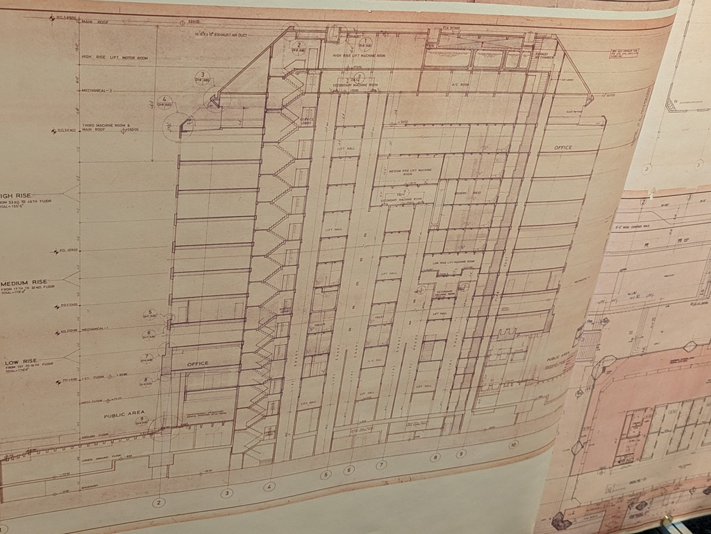

# December 2023 trip, part 7: Reflections

7 January, 2024

All photos are [CC BY-NC-SA](https://creativecommons.org/licenses/by-nc-sa/4.0/). I compressed a bunch; [email me](mailto:dabreegster@gmail.com) if you want originals.

- Part 1: [Hong Kong](pt1_hk.md)
- Part 2: [Tokyo](pt2_tokyo.md)
- Part 3: [Takayama](pt3_takayama.md)
- Part 4: [Karuizawa](pt4_karuizawa.md)
- Part 5: [Kyoto and Narita](pt5_kyoto.md)
- Part 6: [Seoul](pt6_seoul.md)
- Part 7: Reflections
- Part 8: [Technical projects](pt8_tech.md)

I thought about lots of things during December, and I wanted to share some of them.

## People

During my 2019 Japan trip, except for an old friend in Tokyo, I didn't spend time with anyone or have any real conversations. It was OK, but a bit quiet. This time, I still mostly kept to myself, but did space out some socializing -- work friends in Hong Kong, the OSM meetup in Tokyo, and the bouldering group and parkour session in Seoul. This worked much better. Part of this trip's purpose was to isolate for an extended time, but the breaks were purposeful and good. Also, I had many more spontaneous interactions with strangers this trip than any before. Where I might have before quickly shut down a looming conversation with a curious person, I was very open to it this time, and I'm very happy that any old shyness or anxiety about that is long gone.

Also, my home found a few small ways to haunt me. In Chungking Mansions in HK, somebody at a guesthouse was wearing an LSU shirt -- the university in my hometown. They didn't know what it was; it just came from some clothing sale, but still -- curious how that shirt wound up so far from Baton Rouge. And talking to a Korean family touring Kyoto in a Sukiya, one of them had been to New Orleans before for Mardi Gras! It can be a small world.

## Movement

Simply put: I need to live in a place with mountains nearby. This isn't really news... Austin was a fantastic place for me after growing up in Baton Rouge, because things like the greenbelt were so easily accessible and got me into mountain biking. Seattle was great for a while, but all the mountains are about an hour drive, and even before I went car-free, it just became too much of a hassle. London isn't scratching my itch for moving in nature at all. Hampstead and Epping Forest are OK, and Cornwall is fantastic but far... But Kyoto and Seoul have shown me what it'd be like to live in a big city, but be a short transit ride away from real trail.

Since my ACL tear in 2020, I've been exploring the question of how much parkour needs to be in my life. I think the underlying desire itch isn't exclusively satisfied by parkour. All the free-form scrambling on steep trails scratches the same itch, and maybe it does so better... In parkour, I might fight to achieve a flow state for a medium line that lasts maybe 30 seconds. That flow state is all but guaranteed when I'm scrambling, and it just goes on and on. The surfaces are diverse, it's not focused on breaking down one very cerebral challenge over and over -- it's just about moving, usually instinctively. There's less creativity than parkour because everything's spontaneous and not repeated, but if I had more time to idle somewhere along a trail, the same parkour process of finding and remixing deliberate lines could happen.

What's healthy for me? I might try another ACL surgery someday, but even if so, am I going to get back into parkour seriously again? I don't think so staying here -- the London spots and community just aren't the same as Seattle's. All of the hiking and scrambling in contrast feels intuitively great to me -- the cardio, endurance, diversity of angles loading muscles, etc. No matter how much I enjoy parkour, I can't deny that jumps always feel like they have _some_ impact damage, no matter how careful my technique has been. My intuition for scrambling tells me this is good for my body. This is totally unsubstantiated, but I feel like if I could spend an hour doing things like the Kyoto, Myogi, or Seoul National University hikes every few days, I could bulletproof my knees more effectively than all the different rehab and conditioning programs I've tried. And more importantly; I wouldn't have to force myself to do them, because scrambling is inherently fun to me -- rehab is not, it is just a necessary evil. I got into mountain biking and parkour originally to destress and have fun; when movement itself becomes stressful work to rehab, the whole thing feels pointless.

If any MovNat people are reading this, you're saying "duh, of course movement in a natural environment is more therapeutic." I've never really disagreed with their philosophy; it's more that my environment has rarely included natural stuff that felt engaging (ie, scrambly hikes) close by. So what I'm saying is -- I need to change my environment to include this.

And to address a point I've discussed with a friend -- there's of course ambient risk in the kind of off-the-beaten-path scrambles I enjoy and have been describing. I'm very aware that one little mistake will nuke my knee again and mean I have to crawl down, possibly for a while. The thing is -- I'm OK with that, because it's not something I don't feel like I can handle. A week before my ACL surgery, I had a knee buckle going down an icy mountain, and I just crab-walked until I could bear weight again. I trust my inner monkey to deal with it (and probably enjoy the challenge). And the other thing is that my flow state is so utterly perfect when I'm moving in these places by myself. I'm not going to mess up; my entire existence is just the movement. I'm quite sure that any future knee buckles will come from more dumb moments of not paying attention and slipping on mud in the city, or stepping off a bouldering wall, or opening a heavy door, or twisting to reach a cabinet behind me.

## Food and cafes

My standard has been raised; I want to improve what I'm eating. I wish rice and a bunch of fermented vegetables were ubiquitous as a starter. I feel great when I eat them. There are a bunch of recipes on my list to learn.

I wonder what people from Korea and Japan think when they travel west and try the food -- because the takes on westernized food in Asia are, in my opinion, generally better. I'll take a 7-11 sandwich over the Tesco or Pret equivalent anyday.

I stopped thinking about charging my laptop before heading somewhere in Seoul, because finding a table with an outlet was never hard. Also, clean public toilets are everywhere -- it becomes something I just don't think about. Will that ever be true in the UK or US?

I'll miss the Seoul-style cafes that're open late. I've been struggling to find a place open past 5 back in London. I'll also miss Japanese vending machines -- the bottled ice coffee is so cheap and kind of tastes better than an iced Americano, I think.

## That pedestrian life

One day, I'll look for some kind of formal study on walking styles in different places. From my experience, Hong Kong crowd behavior is utter chaos. Even if you've clearly got a crutch, people just walk in every direction with no rhyme or reason and don't really try to dodge other people. In contrast, Tokyo feels super orderly, even in the busiest train stations. There are still people stopping suddenly and checking signs or their phone, but the ratio of people who know where they're going is OK. People in Seoul walk like people in Hong Kong, but the density is never as intense, so it's kind of alright.

I missed the London pace the whole time. Crossing junctions is so much easier here, because the infrastructure is usually designed so that you only have to look at one direction of traffic at a time. Waiting for the light is usually unnecessary, and well over half of people just cross when it's safe. Even if it was safe, crossing against a light would feel so uncomfortable in the places I went.

There were plenty of situations where cars and pedestrians mixed without any pavement (the "curbless" style), but at no point was I really stressed by it.

## Android maps

OsmAnd and AllTrails were a great combo. Especially in Seoul, Google Maps was such a joke; the university, big hiking areas, and big temples were just blank spaces. I downloaded Naver towards the end of Seoul but never got a map displayed, maybe because my phone data was being throttled at that point.

I have many ideas for a mobile map app designed for wandering around a new place, based on my particular style of wandering. But... I need to finish some other projects first, not start more.

## Paper maps

Here's a collection of maps or map-like diagrams I collected through the trip that delighted me:

<figure><figcaption>The hiking map of Mt Myogi has difficulty and time estimates for each edge</figcaption></figure>

<figure><figcaption>More stylized version</figcaption></figure>

<figure><figcaption>From a museum in Seoul</figcaption></figure>

<figure><figcaption>The diagram on the right is almost like Tube map-ish</figcaption></figure>

<figure><figcaption>Plans from a famous building in Hong Kong; I can figure out which one it was if anybody's curious...</figcaption></figure>

<figure><figcaption>Mixed zoning in Seoul</figcaption></figure>

<figure><figcaption>Land parcels from the Karuizawa sunset spot</figcaption></figure>

<figure><figcaption>Pictographic map of Fushimi Inari</figcaption></figure>

<figure><figcaption>This was from a museum in Seoul and I think I remember the context being kind of dark and involving war, but also, it sort of reminds me of the Mauraders Map</figcaption></figure>

<figure><figcaption>Something about the texture of this one is just pleasing</figcaption></figure>

<figure><figcaption>This is almost like those 2D videogame maps that people stitch together from one-screen-at-a-time games</figcaption></figure>

<figure><figcaption>Good choice of canvas</figcaption></figure>

<figure><figcaption>Instead of staring down at your phone to navigate, just trust the wayfinding stones in Kyoto!</figcaption></figure>

## Why'd I take this trip?

This trip was about backing up and giving myself time to reset and figure out what's natural. My life at any time is largely a consequence of choices I made a few years ago. I'm always trying to reflect, re-evaluate, and course-correct, but there's still a build-up of patterns that I have a hard time seeing day-to-day. For me, deeper introspection and change requires a sharp change in environment. I've known this about myself for a long time, but it doesn't necessarily make it any easier to do this ritual.

Besides just going somewhere new, I think in particular the jazz kissa and long hikes were perfect for me to go through this process. They gave me the right space to think. But also, I first needed to get rid of meetings, talking to people, and all the little daily stressors that're part of adult life. From my 2019 notes, I wrote "I haven't been using the language part of my brain. I wonder what has taken over, opportunistically crept into that nook of cranial plasticity?" I think since then, I've learned what kind of things emerge instead, and it's been useful to cultivate that for a bit.

But what exactly was I trying to figure out? In short, in the last year, it's felt like many things have stopped "coming naturally" for me. I'm winding up in more and more situations where I feel pressured to stay consistent with old choices that start to feel alien. To an extent, I'm just describing what it means to be an adult and suck it up and do something without your heart properly in it. But there's been too much of that lately, and I'm a little too good at ignoring how bad that problem gets.

There was one dark hike in Takayama I wanted to do, but I decided to stop because it didn't feel right. I didn't have anything to prove to myself, and -- critically -- there were no external influences, so that was it. I could ignore an earlier decision. I needed a place to have these opportunities to change my mind come up, and to be alone so I could hear them clearly and respond freely.

I wrote about two times when I stopped and could feel my internal state so clearly. That's what I was looking for. And I've been back in London in my regular life for over a week, and I've retained the ability to stop and feel that. I would normally say something like "oh, I've recharged, I've got my inner fire back" -- but for me, the inner fire is the force that burns rather angrily and spurs me to try and fix things that feel wrong. That force has never been sustainable for me. What I've grasped on this trip and so far held onto is a force of stillness. Some of the same problems are still around, but they don't really bother me anymore (and that's not because I'm ignoring them!). I'm working hard, but not getting so tired and burning out. I went to a loud social pub event with friends and enjoyed the whole time; back in November, I would've been exhausted by meeting new people in such a loud place. I'm back to enjoying things without worrying about them. I feel very good.

## 2024?

This is probably the sort of place I'm suposed to make predictions or resolutions about this year, but, eh. In due time. I have some ideas both work/project- and hobby/life-wise, but I've written enough.

One promise: on my next trip, I'll keep a detailed journal and write it up like this again. I haven't had this much fun writing prose in a long time, and my memories of everything nestle nicely in the frames of the stories I've chosen to tell about everything.

One more post will follow this one -- describing the technical projects I started this month. Thanks for reading!
