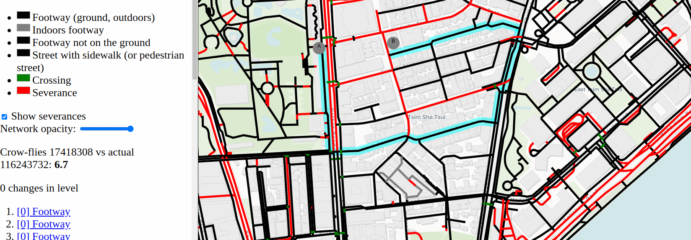
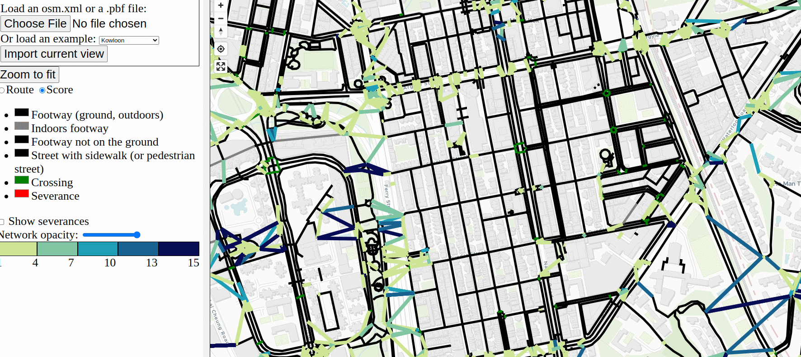

# December 2023 trip, part 8: Technical projects

7 January, 2024

- Part 1: [Hong Kong](pt1_hk.md)
- Part 2: [Tokyo](pt2_tokyo.md)
- Part 3: [Takayama](pt3_takayama.md)
- Part 4: [Karuizawa](pt4_karuizawa.md)
- Part 5: [Kyoto and Narita](pt5_kyoto.md)
- Part 6: [Seoul](pt6_seoul.md)
- Part 7: [Reflections](pt7_reflections.md)
- Part 8: Technical projects

## Introduction

During my month-long holiday, I started a bunch of experimental projects, things on my backlog for a while. I want to describe the results here, because I'm pretty excited about some of them.

Why was I writing code over a holiday? Because I enjoy it -- and I get a bit bored of just being a tourist constantly. It was incredible to return to my own natural pace, which I haven't really had since 2019 -- working exactly when I want. I might start the day with breakfast and a bit of work, wander off and wind up lost on a mountain for a while, and feel like another burst scarily late at 6 or 7pm, and just for for as long as I want. Seoul made this particularly easy, with cafes open very, very late and with plenty of non-caffeinated drinks (sweet potato latte!!!). In a month with very scattered two-or-three-hour sessions, I got an incredible amount done, arguably more than months of regular work. This is my natural pace without the overhead of meetings, interruptions, having to communicate, and conforming to any schedule. (And also I was greenfielding some new ideas; it's always easy to start new stuff.)

And also, I kind of tried this "work on experimental stuff" in the 2022 break, [messing around with TopoJSON and LTN blockfinding](https://github.com/a-b-street/abstreet/issues/1024), but wasn't successful with anything.

## LTN web rewrite

The [Low traffic neighbourhood tool](https://ltn.abstreet.org) is by far my most successful and widely used project. It's also absolutely drowning in technical debt and irrelevant old assumptions, being built on the A/B Street engine. As I've done more web development the last year, I've wondered what a fresh start would look like. <https://github.com/dabreegster/ltn> (use the link on the right to try it out) is the result. (According to git, I've only spent 9 days on it!)

What's it do so far, and how is it different than the real thing?

- There's no concept of pre-built maps anymore; you can import an area from Overpass or feed in any osm.xml or osm.pbf file. The pre-baked examples are just osm.pbf extracts that I'm hosting somewhere.
- Neighbourhood selection is vastly simplified. Instead of trying to partition every single block in the map to a unique neighbourhood, the user can just draw a boundary to do the shortcut and cell analysis. This is doing using the [route-snapper](https://github.com/dabreegster/route_snapper/) area mode.
  - I think the UX of setting a boundary is much simpler than trying to paint blocks, especially when there are "holes". I haven't tried all the problematic areas hit before and with open GH issues, but I think it's more robust.
  - There's no automatic partitioning by main roads. It could be added back in (I have ideas how to do it more simply) but it's not really necessary, and maybe just causes more confusion than it's worth.
  - The chosen boundary is just a polygon, saveable in GeoJSON. The interior and borders of the neighbourhood are calculated from this in a pretty simple way (with a few bugs also present in the current version, that I now understand better...). This totally solves the "robust savefile" problem. I'd like to move the A/B Street save format to use this approach, but modifying a huge existing codebase with existing users and savefiles is hard -- hence the value of this greenfield experiment!
- Once you have a neighourhood boundary, you can explore the shortcuts and cells and add/edit/delete modal filters along roads as usual.
- All edits you make can handle undo/redo, you can save the current state to a GeoJSON file, in local storage, etc.
  - And in fact, a UX problem with the current LTN tool is fixed -- multiple filters made from a freehand line are just one edit to undo in the new one!
- I'm just now starting the route comparison mode.
- I'm not even using osm2streets as base, because it tries to do a bunch of complicated things that're irrelevant for the LTN tool, which just invite bugs. And for example -- using a road's width to represent major/minor is a design choice that could be useful, but osm2streets-based projects are much more tied to the attempted calculation of physical road geometry.

The experiment is far from feature parity -- no diagonal filters, turn restrictions (recently added by Andy), impact prediction, or some of the questionable extra modes (census data, bike network, crossings). What's the future of the LTN tool? Well, I think it's very likely this rewrite -- some of the big pending requests for it would be much easier to add here, and the clear backend / frontend separation would finally allow some possible partner groups to localize it in another language or embed it in another page however they want.

See the section towards the bottom on my new technical approach to projects for how all of this works.

## The crossing tool ("Severance Snape")

I've written a bunch about "severances" I hit while walking around -- places where a pedestrian naturally wants to cross some "desire line", but can't. The idea for this tool has been in my head for about a year, but I needed the right dumb pun to call it and time to start it. December provided both, and now <https://github.com/dabreegster/severance_snape/> exists.

It's a very simple idea. You ask the tool for a walking route between A and B, it calculates that using the pedestrian-specific infrastructure tagged in OSM, and then shows you how much you have to detour from your desire line:

<figure><figcaption>From a park in Kowloon, going east first requires going south. Note this is a bad example; I see a green crossing and probably just found a bug...</figcaption></figure>

Because I was hobbling up and down the ubiquitous subways and bridges of Hong Kong on a crutch my first week, I'm also capturing level changes -- but not yet using them in the penalty.

This one-route mode is already useful to confirm some ridiculous detours I found in person, but it's just the start. As a tourist walking around somewhere new or as a planner trying to study walkability, I want to summarize what parts of a city make it easy to cross a street or not. So the "score mode" attempts to answer this:

<figure><figcaption>Light green is easy to cross, dark blue is hard</figcaption></figure>

It first labels "severances" in red -- these're just main roads in OSM, but could also be rail stations, rivers, big buildings without a way to cut through, etc. Then it tries (poorly) to generate desire lines that connect footways on either side of the severance. It calculates the actual route to cross, then colors by that detour factor. If the actual crossing is close to the straight line, it's green, and if it's a crazy long zig-zag, it's dark blue.

This is my **first** walking-focused project ever; I'm really sorry it took this long. (Cycling data in OSM is just so much easier to work with!) This project needs a bunch more work before it's useful -- the desire lines in score mode are pretty broken and the visualization is very messy -- but I'm very excited to continue it.

## OSM geometry experiment

There's a few ideas I've wanted to start for a long time involving OSM road geometry, but I've felt limited by tooling. Even in osm2streets with the web app, the development cycle of changing code and fiddling with the results is too slow. I want something notebook-like, but with the ability to quickly specify bits of interactivity, like "show a tooltip with an ID when I hover" or "run the merge operation when I click an intersection." So I started something fresh using SVG to render: <https://github.com/dabreegster/canvas_geometry/>

Nothing's usable yet, but I'm using this to experiment with:

- a simpler [intersection geometry](https://a-b-street.github.io/docs/tech/map/geometry/index.html) algorithm, using a WIP GeoRust version of [boolean operations](https://github.com/georust/geo/pull/1089)
- finding the max possible road width using OSM center-lines and buildings, trying out a WIP GeoRust [line offsetting API](https://github.com/georust/geo/pull/935)
- simplifying parallel roads and complex junctions in OSM-based graphs

## My new tech stack / architecture

For a long time, I've been kind of stuck building everything off of the original A/B Street architecture, which was only ever meant for the low-UI traffic simulation. Even though I've started using the web for most frontend things now, some of the backend still defaults to A/B Street assumptions. Through projects this trip, I felt like I finally had time to step back and try some different approaches. I think a few patterns have emerged.

### Trust in GeoRust

It's time to stop using <https://github.com/a-b-street/geom> in new projects. I started this library because GeoRust wasn't as feature-full in 2018 and because I wanted to insist on perfectly valid geometry at all times, catching bugs quickly. Instead now, I've found it easier to just use GeoRust, with a few helpers that I've been copying around, but will upstream soon. And I'm no longer writing code that blows up if a LineString has duplicate coordinates, because trying to uphold those strict assumptions has gone so poorly and not caught problems early, as intended originally.

### osm2streets isn't necessary for everything

It's still mostly tied to the original goals of the traffic simulator. Most of my later projects don't care about road geometry -- or even lane configuration -- at all: the 15-minute tool, Santa, the LTN tool. osm2streets tries to do something very clever, and so it has many bugs. It also forces design decisions that are not always helpful -- like for the LTN tool, using line thickness to show current or proposed road classification would be more helpful than seeing the physical width.

Even osm2lanes is overkill for many projects. And besides, there's a new project <https://gitlab.com/LeLuxNet/Muv/> that's doing the osm2lanes job much better, seemingly. I look forward to trying it out and hopefully cutting over osm2streets and other projects to using it!

### Svelte frontend, Rust backend

<https://github.com/a-b-street/abstreet/tree/main/widgetry> was never meant to do the things it's doing. Over the past year, I've become totally comfortable with Svelte and MapLibre GL, so now, that's my frontend stack of choice. The "backend" is just Rust compiled to WASM. Compile times are so incredibly fast now that half of crates.io isn't getting linked in to do everything a browser can do. And I haven't really missed Rust for writing frontend code; TS and Svelte are fine, and Svelte's "think of things as a component" pattern is so much nicer than the weird design patterns used with widgetry. Plus, Vite's component-level hot reloading has been so nice for iterating quickly.

Unexpectedly, TypeScript has not been so helpful. I'm using it in bigger projects like ATIP, but whittling down the errors in my December experiments to zero and keeping it there doesn't feel easy or useful. My biggest annoyance is that you can't write TS inside the Svelte HTML markup section, so things like on-click handlers can't use `!` to insist on non-nullness. Fixing errors like this is very boilerplatey. And maybe the projects are small enough right now that there's not too much for a type checker to catch, anyway. The bigger problem is probably that there's no defined API between the frontend and backend -- it's an ad-hoc mix of GeoJSON and JSON-ified custom structures. I need to play around with <https://github.com/ratchetdesigns/ts-bindgen> and <https://github.com/Aleph-Alpha/ts-rs> to see if there's a nicer approach that isn't tedious.

Although MapLibre is great, some of its API is still quite painful to work with. <https://github.com/dimfeld/svelte-maplibre/> has made it much better, but it still can't do everything I need it to. I even started trying SVG for rendering and interactivity with the misnomer <https://github.com/dabreegster/canvas_geometry/>, and using CSS for styling is so much nicer than MapLibre style expressions.

But some things are still much easier with widgetry, particularly <https://github.com/a-b-street/abstreet/blob/main/widgetry/src/mapspace/world.rs>. Neither MapLibre nor SVG make z-indexing across layers easy, and handling hovering / selection properly is still tedious and buggy with both. I still need to find an approach that's better.

### Simplify deployment

Web-only means the release process can be super simple. No need to build for multiple platforms, just use GitHub Actions and deploy to Pages for every commit. Even more, instead of storing the imported map files derived from OSM data somewhere, just re-import from scratch every time. This used to mean a performance hit, and probably still does, but using osm.pbf (a recent advancement in my projects) minimizes the delay, and it saves me so much headache. No more need to reimport a growing number of places when code changes, and making it easy for someone to preload a new place is just a matter of sticking an osm.pbf extract somewhere.

## Smaller stuff

### elevation TIFF reader

Finally I had time to play with <https://github.com/pka/georaster/>, which can read TIFF files often used for digital elevation models. I made a thin wrapper <https://github.com/dabreegster/elevation> (which will later just be upstreamed in georaster) and am [using it in A/B Street](https://github.com/a-b-street/abstreet/pull/1134) now instead of the previous Python/GDAL approach. Faster and more portable!

### osm-reader

A contributor added osm.pbf support to osm2streets a while back, and tired of copying similar code in a few of the new projects, I refactored <https://github.com/a-b-street/osm-reader> to wrap XML and PBF reading, so a library doesn't have to care. This crate, plus a simple function to split OSM ways into a proper graph, are one reason why the osm2streets-less approach in newer projects is so easy.

### Faster A/B Street import process

There are 226 maps (over 156 cities) prebaked into A/B Street, and I have a mostly automated process for reimporting them all. Even on my fastest laptop, it's still a chore. So with the new elevation crate and switching to PBFs for the A/B Street import process, the time to regenerate the maps is now down to just 15 minutes, making this process less bad!

### route-snapper

I released 0.3, a breaking change with [a big simplification](https://github.com/dabreegster/route_snapper/pull/47) -- no more osm2streets or Mercator coordinates needed. This project now follows the "just use GeoRust" approach and also avoids a problem with Haversine distances having too much error in large areas.

## Conclusion

OK this blog series is really over now. Thanks for reading!
